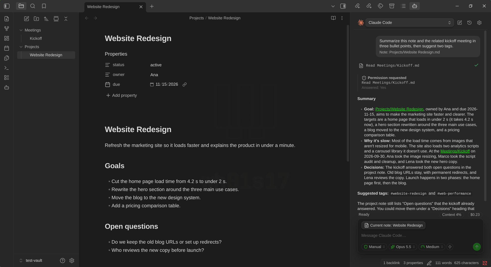
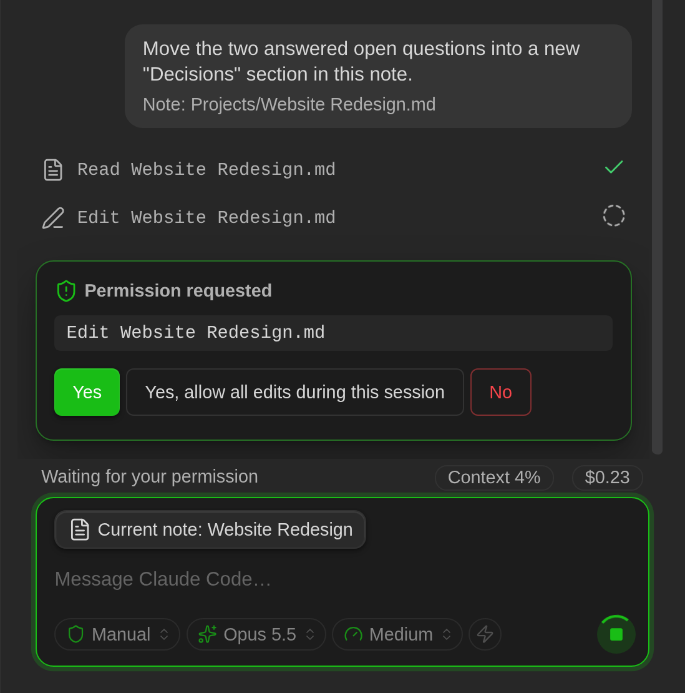
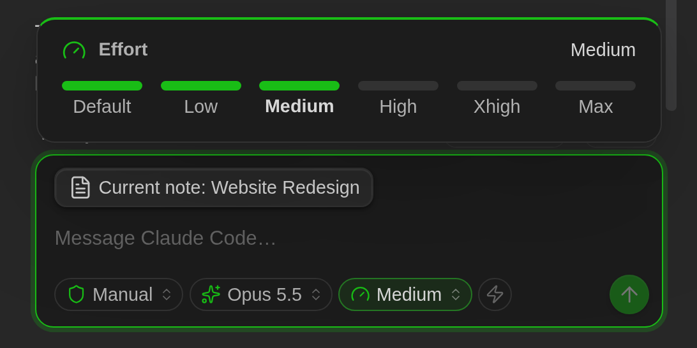
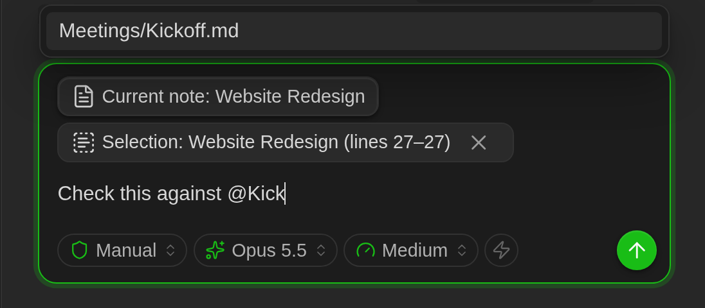
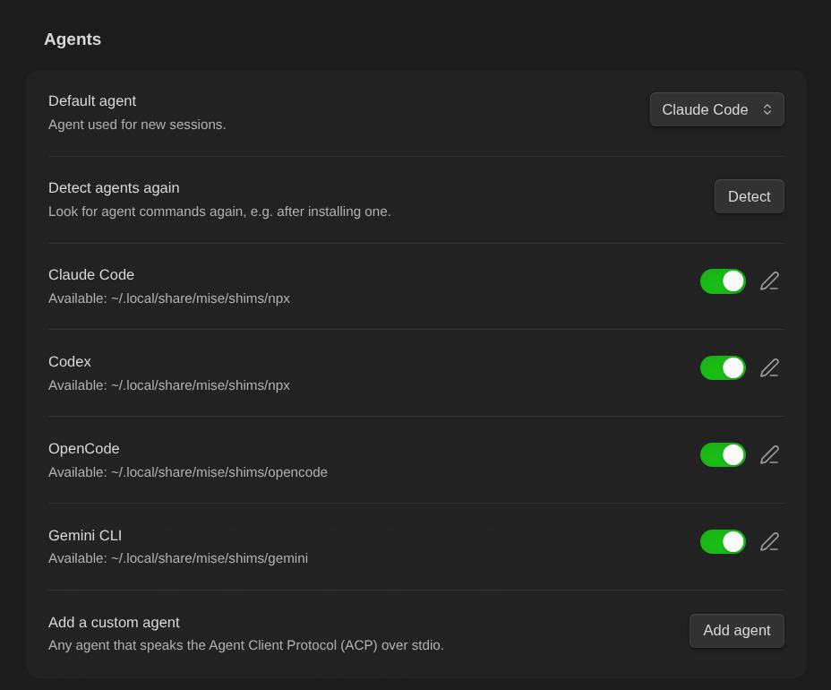
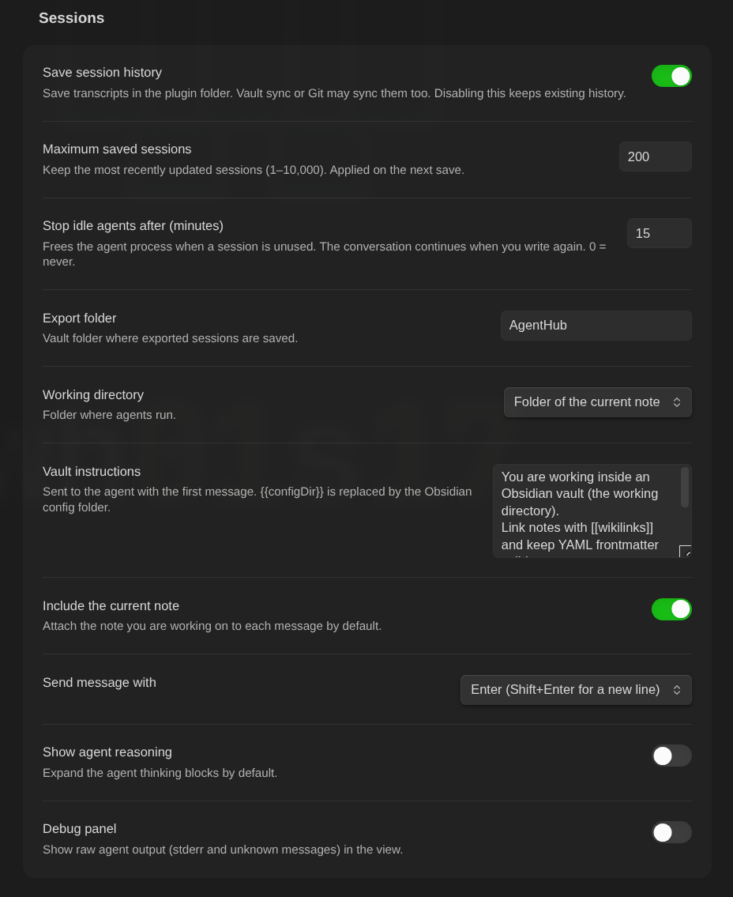
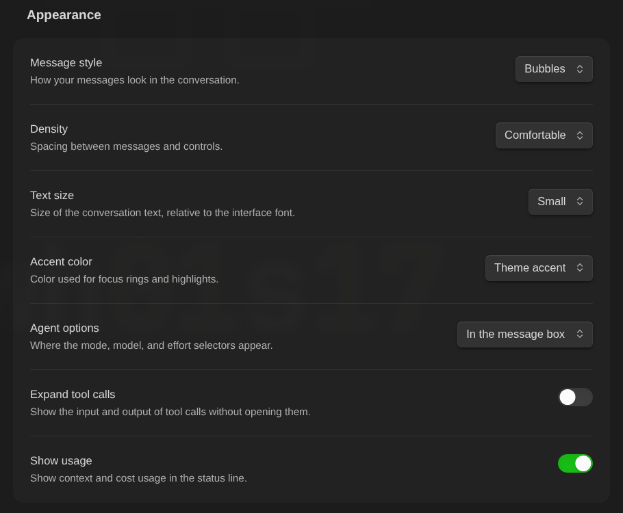
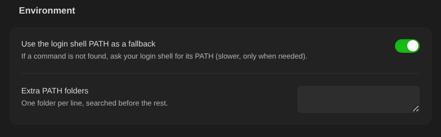

# AgentHub

A desktop Obsidian plugin for working with **Claude Code**, **Codex**, **Gemini CLI**, **OpenCode**, and other coding agents from a sidebar, with your notes as context.

## Contents

- [Features](#features)
- [Screenshots](#screenshots)
- [Requirements](#requirements)
- [Installation](#installation)
- [Usage](#usage)
- [Settings](#settings)
- [Privacy and security](#privacy-and-security)
- [Troubleshooting](#troubleshooting)
- [Development](#development)
- [Releasing](#releasing)
- [License](#license)

## Features

- **Agent chat:** streaming responses rendered with Obsidian's Markdown engine.
- **Visible tools:** file reads, edits, and commands appear in the conversation. Edits show a diff, and file links open the corresponding note.
- **Tabs:** run several conversations side by side in one view, each with its own agent. A tab shows when its agent is working, waiting for permission, failed, or finished while you were elsewhere, and a notice tells you when a hidden tab asks for permission. Drag tabs (or press **Ctrl/Cmd+Shift+Left/Right**) to reorder them.
- **Interactive permissions:** approve once, approve future requests when offered by the agent, or deny. Use **Stop** to cancel a turn.
- **Note context:** attach the current note, send a selection, or mention notes with **`@`**. Autocomplete agent commands with **`/`**.
- **Images:** paste screenshots, drop image files on the message box, or attach them with the image button. Large images are scaled down to fit the agents' limits.
- **Agent options:** choose the mode, model, reasoning effort, and other options exposed by the agent from pills in the message box. Your choices are kept for new sessions and after restarting Obsidian.
- **Prompt history:** press **Up** and **Down** in the message box to recall the prompts sent since Obsidian started.
- **Session history:** save, search, rename, delete, and resume conversations. Restore your conversation after restarting Obsidian.
- **Export to Markdown:** save a conversation as a note.
- **Agent identity:** original logos for supported agents and colored monograms for custom agents.
- **Appearance:** bubbles, cards, or plain messages, compact or comfortable spacing, text size, and the agent's color or your theme accent. Everything uses your Obsidian theme.

## Screenshots

### Chat

Claude Code summarizing the open note and a linked one, with a tool call, an answered permission request, and the agent options in the message box:



### Permissions, options, and context

| Permission requests | Agent options and context |
|---|---|
|  |  <br>  |

### Settings screens

| Agents | Sessions |
|---|---|
|  |  |
| **Appearance** | **Environment** |
|  |  |

## Requirements

- **Desktop Obsidian 1.8.7 or newer.** Mobile is not supported because the plugin launches local processes.
- The agents you want to use, **installed and authenticated** on your computer.
- **Node.js**, including `npx`, for the Claude Code and Codex ACP adapters. `npx` downloads each adapter on first use.

| Agent | Command used by AgentHub | Before using it |
|---|---|---|
| Claude Code | `npx -y @agentclientprotocol/claude-agent-acp@0.85.0` | Sign in with `claude` (`/login`). |
| Codex | `npx -y @agentclientprotocol/codex-acp@2.1.1` | Run `codex login`. |
| OpenCode | `opencode acp` | Run `opencode auth login`. |
| Gemini CLI | `gemini --acp` | Disabled by default: personal Gemini Code Assist accounts do not support this client. |
| Custom agents | Any agent that speaks [ACP](https://agentclientprotocol.com) over stdio | Add it in settings. |

To reduce the first startup delay, you can install the adapters globally:

```bash
npm i -g @agentclientprotocol/claude-agent-acp @agentclientprotocol/codex-acp
```

## Installation

### Community plugins

1. In Obsidian, open **Settings → Community plugins** and turn off **Restricted mode** if it is on.
2. Select **Browse**, search for **AgentHub**, and select **Install**.
3. Select **Enable**.

You can also open the [AgentHub listing](https://community.obsidian.md/plugins/agenthub) directly.

### BRAT

Use BRAT to try beta versions before they reach the community directory.

1. Install and enable BRAT in Obsidian.
2. Run **BRAT: Add a beta plugin** and enter `wh01s17/agenthub-plugin-obsidian`.
3. Enable **AgentHub** under **Settings → Community plugins**.

BRAT downloads the release files and manages updates.

### Manual installation

1. Download `main.js`, `manifest.json`, and `styles.css` from a [release](https://github.com/wh01s17/agenthub-plugin-obsidian/releases), or build them locally.
2. Copy them into `<your-vault>/.obsidian/plugins/agenthub/`.
3. Enable **AgentHub** under **Settings → Community plugins**.

Back up your vault or keep it under version control before allowing an agent to edit it.

## Usage

- Open the sidebar using the **robot ribbon icon** or the **Open AgentHub** command.
- Choose an agent in the header and its options with the pills in the message box, type your message, and press **Enter**. Use **Shift+Enter** for a new line. You can configure **Ctrl/Cmd+Enter** to send instead.
- Press **Up** in an empty or single-line message to recall the prompts you sent since Obsidian started, and **Down** to go forward again.
- Type **`@`** to mention a note, or **`/`** at the start of a message to autocomplete agent commands.
- Use the **clock icon** for session history and the **pencil icon** for a new session in the current tab.
- Use **`+`** in the tab bar at the top of the view to open another tab with the default agent. Double-click a tab to rename it, and close it with **×** or the middle mouse button; closing a tab stops its agent (the conversation stays in history). Sessions opened from history get their own tab, and your tabs reopen after restarting Obsidian.

Commands have no default keyboard shortcuts. Assign them under **Settings → Hotkeys**.

| Command | Action |
|---|---|
| Open AgentHub | Open or reveal the sidebar. |
| Open AgentHub in a new pane | Open another view with its own session. |
| Send selection to AgentHub | Attach selected text to the next message; also available in the editor context menu. |
| Ask AgentHub about the current note | Open the sidebar with the current note attached. |
| Start a new AgentHub session | Start a conversation with the same agent in the current tab. |
| Open a new AgentHub tab | Open a tab with the default agent. |
| Close the current AgentHub tab | Close the tab and stop its agent. |
| Go to the next / previous AgentHub tab | Switch between tabs. |
| Stop the current AgentHub turn | Cancel the current turn. |
| Export the AgentHub session to a note | Create a conversation note in the configured export folder. |

## Settings

- **Agents:** enable or disable agents, check detection results, edit commands, arguments, environment variables, and initial options, add custom ACP agents, and run detection again. The options you choose in the message box are saved as the agent's initial options.
- **Sessions:** working directory (vault root, current note folder, or a custom folder), vault instructions, current note context, send key, reasoning display, debug panel, history and retention, export folder, idle timeout, how many agents may work at once, and the shared-edit warning. The default idle timeout is 15 minutes; the conversation resumes when you send another message. With a limit on agents working at once (off by default), extra messages wait their turn; **Stop** takes a waiting message out of the queue. The shared-edit warning (on by default) shows a notice when an agent edits a file that an agent in another tab or pane has also edited.
- **Appearance:** message style, density, text size, accent color, where the agent options appear (message box or above the conversation), expanded tool calls, and usage display. Changes apply at once.
- **Environment:** use the login shell PATH as a fallback when a command cannot be found, and configure additional PATH folders.

## Privacy and security

### Disclosures

- **External processes:** AgentHub runs the agent commands configured in its settings as local child processes. It does not bundle or run any agent itself.
- **Network use:** the plugin makes no network requests and sends no telemetry. The agents you run connect to their own providers (for example Anthropic for Claude Code, OpenAI for Codex, Google for Gemini CLI, or the provider configured in OpenCode) to generate responses, under those providers' terms.
- **Adapter downloads:** AgentHub never installs or updates itself, the agents, or their adapters. The default Claude Code and Codex commands call `npx` with a **pinned adapter version**; on first use, `npx` (not AgentHub) fetches that version from the npm registry. To avoid any download at runtime, install the adapters globally (see [Requirements](#requirements)) and change the command to the installed binary, or use any other command you trust.
- **Accounts:** an account with each agent's provider is required, signed in through the agent's own CLI. Depending on the provider, this may require a paid subscription or API usage. AgentHub never sees or stores your credentials.
- **Files outside the vault:** agents run with the vault (or the working directory you choose) as their working directory, but they are regular programs: depending on their permission mode they can read or write files and run commands anywhere your user account can. When an agent reads or writes through AgentHub itself (the ACP file channel), access is limited to the vault, and writes to the Obsidian configuration folder are blocked. AgentHub also looks up the agents' executables in your `PATH` and, when the login shell PATH fallback is enabled, runs your login shell once to read its `PATH`.

### Security

- Agents can **read and modify vault files and execute commands** according to their permission mode. Codex starts in **read-only** mode unless you configure another initial mode.
- Activating `bypassPermissions`, `danger-full-access`, `agent-full-access`, or `yolo` requires confirmation and displays a red warning in the header; the mode pill also turns red. If such a mode is saved as your choice, AgentHub asks again every time the agent starts. OpenCode uses its own mode: check its selector.
- The prompt history used by **Up** and **Down** stays in memory and is cleared when Obsidian restarts.
- Notes can contain malicious instructions that an agent might follow. Review permission requests before approving them.
- Conversations, attached notes, selections, and images are stored in `<configDir>/plugins/agenthub/sessions/`, usually inside `.obsidian`. Vault sync or Git may include these files. You can disable history or change its retention limit in settings; the default is 200 sessions.
- Per-agent environment variables are stored as plain text in the plugin's settings data.

## Troubleshooting

- **Agent command not found:** install the agent or configure its absolute path. If you use mise, nvm, or another version manager and launch Obsidian from your desktop, enable the login shell PATH fallback or add the relevant PATH folder.
- **Authentication required:** run the agent's sign-in command in a terminal.
- **Slow first startup:** `npx` may be downloading the ACP adapter. Install the adapter globally to avoid that delay.
- **Gemini options:** model and mode selectors appear after ACP initialization, including agents using the older `models` and `modes` fields. Gemini 0.62 does not expose a reasoning effort selector through ACP. Authentication failures appear in the chat.
- **Loading errors:** open developer tools with **Ctrl+Shift+I** (**Cmd+Opt+I** on macOS) and filter for `AgentHub`. Enable the debug panel in settings to inspect raw agent output.

## Development

Requirements: Node.js 22 or newer and pnpm.

```bash
pnpm install
pnpm build         # Type-check and build main.js with esbuild
pnpm link-vault    # Link the build into the test vault
pnpm dev           # Rebuild on changes
pnpm lint
pnpm test          # Vitest; use pnpm test:coverage for coverage
pnpm test:e2e      # Real agents: AGENTHUB_E2E_AGENTS=opencode,claude-acp,codex-acp
pnpm fake-agent    # Simulated ACP agent; no model tokens required
```

Open `test-vault/` through **Manage vaults → Open folder as vault**, then enable community plugins and AgentHub. With **Hot Reload** by pjeby installed in that vault, `pnpm dev` reloads AgentHub after changes.

Contributor instructions are in [`AGENTS.md`](AGENTS.md); architecture and development decisions are in [`plan.md`](plan.md).

## Releasing

Follow the version policy in [`plan.md` §8.4](plan.md#84-versionado-y-releases). During 0.x development, use a **MINOR** version for new features or behavior/data changes, and a **PATCH** version for fixes, styling, performance, or documentation.

1. Start from a clean checkout synchronized with `origin`. Run `pnpm lint && pnpm test && pnpm build`, and update `CHANGELOG.md`.
2. Edit the version in `package.json`, then run `npm_package_version=X.Y.Z node scripts/version-bump.mjs` to update `manifest.json` and `versions.json`. Do not use `pnpm version`.
3. Commit as `chore(release): X.Y.Z`, create an annotated tag **without a `v` prefix** using `git tag -a X.Y.Z -m "AgentHub X.Y.Z"`, then push the commit and the tag **together** (`git push origin main X.Y.Z`). Obsidian reads the version from `manifest.json` on `main`, so a manifest pushed without its release breaks installs and updates.
4. The release workflow validates and builds the plugin, then creates a **draft** containing `main.js`, `manifest.json`, and `styles.css`, with GitHub artifact attestations for their provenance.
5. Publish after the maintainer confirms, using the changelog notes. Record the release in the development log, then select **Check for new releases** on the [community directory listing](https://community.obsidian.md/plugins/agenthub) so the automated review checks the new version. Beta versions (`X.Y.Z-beta.N`) are **prereleases**, are not marked **Latest**, and are tested with BRAT.

## License

MIT. Agent logos come from [Lobe Icons](https://github.com/lobehub/lobe-icons) (MIT). Trademarks belong to their respective owners and are used to identify the corresponding tools.
