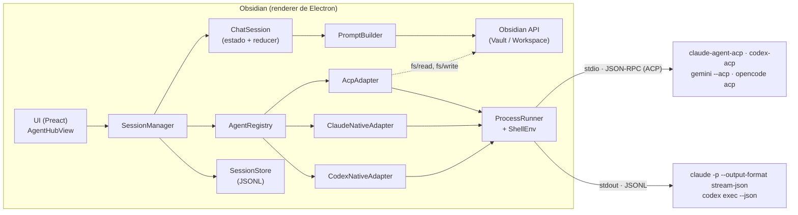
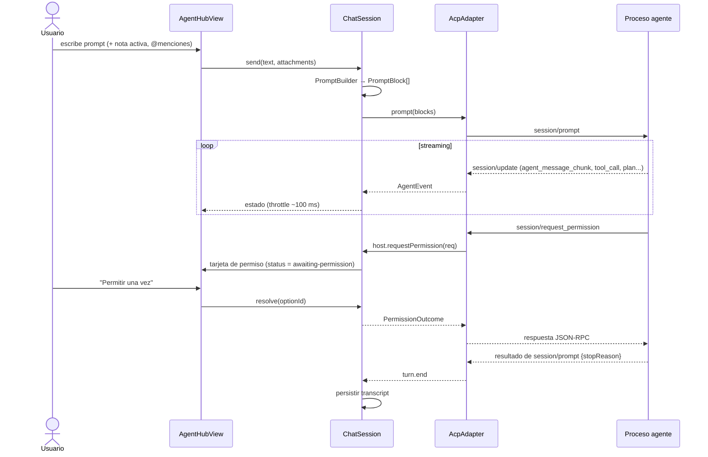

# AgentHub — Arquitectura

> Parte del plan maestro. Empieza siempre por [`plan.md`](../../plan.md) (estado actual y protocolo).
> Los números de sección (§) son los mismos en todos los archivos del plan.

## 4. Arquitectura

### 4.1 Vista general



Principio rector: **el modelo de dominio interno tiene la forma de ACP.** El `AcpAdapter` es
casi una traducción 1:1; los adaptadores nativos son "shims" que convierten la salida JSONL de cada
CLI a los mismos eventos. La UI y el resto del núcleo nunca conocen el formato de un agente concreto.

### 4.2 Capas y responsabilidades

| Capa | Módulos | Responsabilidad | Depende de |
|---|---|---|---|
| Plugin | `main.ts` | Ciclo de vida, registro de vista/comandos/ajustes, apagado de procesos. | todas |
| UI | `ui/` | Renderizar estado de sesión, capturar input, resolver permisos. | core (lectura), Obsidian |
| Core | `core/` | Modelo de dominio, `SessionManager`, `ChatSession`, `PromptBuilder`, `AgentRegistry`. | interfaces |
| Adaptadores | `adapters/` | Traducir protocolo de cada agente ↔ eventos de dominio. | process, core/types |
| Proceso | `process/` | Spawn, stdio, terminación de árbol, entorno/PATH, binarios. | Node |
| Persistencia | `storage/` | Índice y transcripts de sesiones, export a nota. | Obsidian adapter |
| Puente (fase 5) | `bridge/` | Servidor MCP local (permisos para Claude directo, herramientas del vault). | Node http |

Regla: `core/` y `adapters/` **no importan `obsidian`** (salvo tipos inyectados por interfaces),
para poder testearlos con Vitest sin Obsidian. Lo que necesitan de Obsidian llega por un
`HostBridge` inyectado (leer/escribir archivos del vault, ruta base, etc.).

### 4.3 Modelo de dominio (`src/core/types.ts`)

> **Implementado en T2.1.** El código de `src/core/types.ts` es la fuente de verdad; el bloque siguiente es
> orientativo y puede quedar desfasado en detalles (p. ej. `rawOutput` en `ToolCall`, `SessionStatus`).

```ts
export type AgentId = string; // 'claude-acp', 'codex-acp', 'gemini', 'opencode', 'claude-native', ...

export type ToolKind =
  | 'read' | 'edit' | 'delete' | 'move' | 'search' | 'execute' | 'think' | 'fetch' | 'other';
export type ToolStatus = 'pending' | 'in_progress' | 'completed' | 'failed';
export type StopReason =
  | 'end_turn' | 'max_tokens' | 'max_turn_requests' | 'refusal' | 'cancelled' | 'error';

export interface ToolCall {
  id: string;
  title: string;
  kind: ToolKind;
  status: ToolStatus;
  rawInput?: unknown;
  locations?: { path: string; line?: number }[];
  content?: ToolContent[];
}
export type ToolContent =
  | { type: 'text'; text: string }
  | { type: 'diff'; path: string; oldText: string | null; newText: string }
  | { type: 'terminal'; output: string; exitCode?: number };

export interface PlanEntry { content: string; status: 'pending' | 'in_progress' | 'completed'; priority?: 'high' | 'medium' | 'low' }
export interface SlashCommand { name: string; description?: string; inputHint?: string }
export interface ModeInfo { id: string; name: string; description?: string }
export interface ModelInfo { id: string; name: string }
export interface Usage {
  inputTokens?: number; outputTokens?: number; cachedInputTokens?: number;
  costUsd?: number;
  contextUsed?: number; contextSize?: number;          // ACP usage_update {used, size}
}
export interface ConfigOption {                         // ACP configOptions (modo, modelo, …)
  id: string; name: string; description?: string;
  category?: 'mode' | 'model' | string;
  currentValue: string;
  options: { value: string; name: string; description?: string }[];
}

export type AgentEvent =
  | { type: 'session.ready'; nativeSessionId: string; configOptions?: ConfigOption[]; modes?: ModeInfo[]; currentModeId?: string; models?: ModelInfo[]; currentModelId?: string }
  | { type: 'config'; configOptions: ConfigOption[] }
  | { type: 'message.chunk'; role: 'assistant' | 'user'; messageId: string; text: string } // messageId del agente si lo envía
  | { type: 'thought.chunk'; messageId: string; text: string }
  | { type: 'message.end'; messageId: string }
  | { type: 'tool.call'; call: ToolCall }
  | { type: 'tool.update'; id: string; patch: Partial<Omit<ToolCall, 'id'>> }
  | { type: 'plan'; entries: PlanEntry[] }
  | { type: 'commands'; commands: SlashCommand[] }
  | { type: 'mode'; currentModeId: string }
  | { type: 'usage'; usage: Usage }
  | { type: 'permission.denied'; toolName: string; input?: unknown } // modo directo sin prompts interactivos
  | { type: 'turn.end'; stopReason: StopReason }
  | { type: 'error'; message: string; recoverable: boolean; detail?: string }
  | { type: 'debug'; source: 'stdout' | 'stderr' | 'rpc'; line: string };

export type PromptBlock =
  | { type: 'text'; text: string }
  | { type: 'file'; path: string; absPath: string; text?: string }    // nota/archivo del vault
  | { type: 'selection'; path: string; text: string; fromLine: number; toLine: number }
  | { type: 'image'; mimeType: string; data: string };                  // base64

export interface PermissionRequest {
  id: string;
  toolCall: Pick<ToolCall, 'id' | 'title' | 'kind' | 'rawInput' | 'locations'>;
  options: { id: string; label: string; kind: 'allow_once' | 'allow_always' | 'reject_once' | 'reject_always' }[];
}
export type PermissionOutcome = { outcome: 'selected'; optionId: string } | { outcome: 'cancelled' };
```

Estado de UI (derivado por un *reducer* puro a partir de los eventos — testeable con fixtures):

```ts
export type TranscriptItem =
  | { kind: 'user'; id: string; blocks: PromptBlock[]; at: number }
  | { kind: 'assistant'; id: string; text: string; streaming: boolean }
  | { kind: 'thought'; id: string; text: string; streaming: boolean }
  | { kind: 'tool'; call: ToolCall }
  | { kind: 'plan'; entries: PlanEntry[] }
  | { kind: 'permission'; request: PermissionRequest; resolved?: PermissionOutcome }
  | { kind: 'notice'; level: 'info' | 'warning' | 'error'; text: string };

export interface SessionViewState {
  localId: string;                 // uuid local de AgentHub
  agentId: AgentId;
  nativeSessionId?: string;        // id del agente (para reanudar)
  title: string;
  cwd: string;
  status: 'idle' | 'starting' | 'running' | 'awaiting-permission' | 'error' | 'closed';
  items: TranscriptItem[];
  modes?: ModeInfo[]; currentModeId?: string;
  models?: ModelInfo[]; currentModelId?: string;
  commands: SlashCommand[];
  usage?: Usage;
}
```

### 4.4 Interfaz de adaptadores (`src/core/AgentAdapter.ts`)

> **Implementado en T2.1** (fuente de verdad: `src/core/AgentAdapter.ts`). Cambios respecto al bloque: modo y
> modelo se fijan con `SessionOptions.config` (`{ mode: 'plan' }`) y `AgentSession.setConfigOption()` (ADR-015),
> sin `setMode`/`setModel`; `AgentCapabilities` tiene `configOptions` en lugar de `modes`/`models`.

```ts
export interface Disposable { dispose(): void }

export interface HostBridge {
  vaultBasePath: string;
  env: () => Promise<NodeJS.ProcessEnv>;                         // entorno resuelto (§4.7)
  readTextFile(absPath: string, line?: number, limit?: number): Promise<string>;
  writeTextFile(absPath: string, content: string): Promise<void>; // vía Vault API si está dentro del vault
  requestPermission(req: PermissionRequest): Promise<PermissionOutcome>; // la UI lo resuelve
  log: Logger;
}

export interface AgentCapabilities {
  streaming: boolean;              // deltas de texto
  interactivePermissions: boolean;
  loadSession: boolean;            // reanudar con historial
  embeddedContext: boolean;        // acepta contenido de archivos embebido
  images: boolean;
  modes: boolean;
  models: boolean;
  slashCommands: boolean;
  usage: boolean;
}

export interface DetectionResult {
  status: 'available' | 'missing' | 'error';
  version?: string;
  resolvedCommand?: string;        // ruta absoluta del binario/comando
  message?: string;                // instrucciones si falta o falla
}

export interface SessionOptions {
  cwd: string;
  modeId?: string;
  modelId?: string;
  systemPromptAppend?: string;     // instrucciones del vault (§4.8)
  extraArgs?: string[];
  env?: Record<string, string>;
}

export interface AgentSession {
  readonly nativeSessionId: string | undefined; // puede llegar tras el primer turno (modo directo)
  readonly capabilities: AgentCapabilities;
  onEvent(listener: (e: AgentEvent) => void): Disposable;
  prompt(blocks: PromptBlock[]): Promise<StopReason>;
  cancel(): Promise<void>;
  setMode?(modeId: string): Promise<void>;
  setModel?(modelId: string): Promise<void>;
  setConfigOption?(id: string, value: string): Promise<void>; // preferido sobre setMode/setModel si existe
  dispose(): Promise<void>;        // mata el proceso, libera recursos
}

export interface AgentAdapter {
  readonly id: AgentId;
  readonly label: string;
  detect(host: HostBridge): Promise<DetectionResult>;
  createSession(opts: SessionOptions, host: HostBridge): Promise<AgentSession>;
  loadSession?(nativeSessionId: string, opts: SessionOptions, host: HostBridge): Promise<AgentSession>;
}
```

### 4.5 Flujo de un turno (ACP)



Cancelación: botón detener → `session.cancel()` → ACP `session/cancel`; los permisos pendientes se
resuelven con `cancelled`; si el agente no responde en 5 s, se mata el proceso y la sesión queda
reanudable (si `loadSession`) o se marca cerrada.

### 4.6 Gestión de procesos (`src/process/ProcessRunner.ts`)

- Lanzar con `cross-spawn` (manejo correcto de `.cmd` y comillas en Windows) o `child_process.spawn`
  en POSIX. `stdio: ['pipe','pipe','pipe']`, `cwd` de la sesión, `env` resuelto + env del agente.
- Variables añadidas por defecto: `NO_COLOR=1`, `FORCE_COLOR=0`, `TERM=dumb` (evitar ANSI en JSON).
  ⚠️ En S1 comprobar si heredar variables `ELECTRON_*`/`NODE_OPTIONS` del renderer causa problemas; si es así, filtrarlas.
- POSIX: `detached: true` para crear grupo de procesos y poder matar el árbol con
  `process.kill(-pid, 'SIGTERM')` → `SIGKILL` a los 3 s. Windows: `taskkill /PID <pid> /T /F`.
- **Registro global** de procesos vivos (`ProcessRegistry`): `onunload` del plugin y
  `window` `beforeunload` matan todos. Además, al cerrarse Obsidian la tubería stdin se cierra y los
  agentes ACP terminan por EOF.
- stdout: decodificación UTF-8 con `StringDecoder` (caracteres multibyte partidos entre chunks),
  separación por líneas (JSONL), límite de longitud de línea configurable (p. ej. 10 MB) para no reventar memoria.
- stderr: *ring buffer* de las últimas ~200 líneas para mostrar en errores y en el panel de debug.
- Para ACP: convertir stdio a web streams (`Writable.toWeb(stdin)`, `Readable.toWeb(stdout)`) y
  pasarlas a `ndJsonStream` del SDK.
- **Reaper de inactividad:** sesiones sin actividad durante `idleTimeoutMin` (defecto 15) liberan su
  proceso; se relanzan al enviar el siguiente prompt (vía `loadSession`/`--resume`).

### 4.7 Resolución de entorno y binarios (`src/process/ShellEnv.ts`, `BinaryResolver.ts`)

0. Resolver primero con `process.env` (S1: suficiente en este equipo). Solo si algún comando no se encuentra:
1. Ejecutar **de forma asíncrona** (≈1,4 s medidos en S1; nunca `spawnSync` en el hilo de la UI) y cachear el shell de login del usuario:
   `$SHELL -ilc 'printf "__AGH_START__"; env -0; printf "__AGH_END__"'` con timeout de 5 s.
   Los marcadores aíslan ruido de `.zshrc` (banners, prompts). Parsear `env -0` (separado por NUL).
2. Fusionar: `process.env`; las rutas del `PATH` del shell se **añaden al final** (no cambian qué binario gana si ya existía);
   `settings.env.extraPath` se antepone; luego el env del agente.
3. Si el shell falla o excede el timeout: usar `process.env` + rutas comunes:
   `~/.local/bin`, `~/.local/share/mise/shims`, `~/.local/share/mise/installs/*/latest{,/bin}`,
   `~/.npm-global/bin`, `~/.bun/bin`, `~/.cargo/bin`, `/usr/local/bin`, `/opt/homebrew/bin`,
   versiones de `~/.nvm` / `~/.config/nvm`.
4. `BinaryResolver.which(cmd, env)`: recorre `PATH` (y `PATHEXT` en Windows). Si el usuario configuró
   una ruta absoluta en ajustes, se usa tal cual.
5. Botón "Re-detectar agentes" en ajustes invalida la caché.
6. Windows: no se hace paso 1; se usa `process.env` (las GUI heredan el PATH de usuario).

### 4.8 Contexto de Obsidian → prompt (`src/core/PromptBuilder.ts`)

Entradas: texto del usuario, nota activa (si el toggle está activo), selección, `@menciones`,
imágenes pegadas (fase posterior), instrucciones del vault.

- **ACP:** `text` con el mensaje; cada nota → `resource_link` (`file:///abs/path`); la selección →
  `resource` embebido (`text/markdown`) si `embeddedContext`, si no → bloque de texto.
- **Modo directo (Claude/Codex):** todo se serializa como texto antes del mensaje:

```text
<obsidian-context>
Vault: /ruta/absoluta/al/vault   (directorio de trabajo)
Nota activa: Proyectos/Idea.md
Selección (Proyectos/Idea.md, líneas 10–24):
"""
…texto seleccionado…
"""
Notas referenciadas: Proyectos/A.md, Proyectos/B.md
</obsidian-context>

<mensaje del usuario>
```

- **Instrucciones del vault** (configurables, texto por defecto en ajustes): que es un vault de
  Obsidian, usar `[[wikilinks]]`, respetar frontmatter YAML, no tocar `.obsidian/`, preferir
  rutas relativas al vault. Claude directo → `--append-system-prompt`; ACP/Codex → se antepone en el
  **primer** prompt de la sesión como bloque de texto.
- Las rutas se pasan **relativas al vault** en el texto y **absolutas** en `resource_link`.
- Límite de tamaño de contexto embebido (p. ej. 200 KB) con aviso si se trunca.

### 4.9 Permisos

| Vía | Mecanismo | Fase |
|---|---|---|
| ACP | `session/request_permission` → tarjeta inline en el chat con las opciones del agente. "Siempre" lo gestiona el propio agente (la opción `allow_always`). | 2 |
| Claude directo (básico) | El usuario elige `--permission-mode` antes del turno; `--permission-prompts none`; las denegaciones (`permission_denials` del `result`) se muestran con botón "Permitir y reintentar" (relanza con `--allowedTools` añadido y `--resume`). | 5 |
| Claude directo (interactivo) | Servidor MCP local del plugin + `--permission-prompt-tool mcp__agenthub__approve` ⚠️. | 5 (opcional) |
| Codex directo | Selector de sandbox (`read-only` por defecto, `workspace-write`, `danger-full-access` con confirmación). Aprobaciones interactivas solo vía ACP o `app-server`. | 5 |

Reglas de UI: mientras haya un permiso pendiente, el estado es `awaiting-permission`, el compositor
sigue activo pero el botón principal muestra "Detener"; notificación (`Notice`) si la vista no es visible.
Modos peligrosos (`bypassPermissions`, `danger-full-access`, `yolo`) piden confirmación explícita
cada vez que se activan y muestran un distintivo rojo en la cabecera.

### 4.10 Persistencia (`src/storage/SessionStore.ts`)

```
<vault>/.obsidian/plugins/agenthub/
├── main.js · manifest.json · styles.css
├── data.json                    # ajustes (loadData/saveData)
└── sessions/
    ├── index.json               # [{localId, agentId, nativeSessionId, title, cwd, createdAt, updatedAt}]
    └── <localId>.jsonl          # transcript: 1 línea = {v:1, t, item}  (TranscriptItem consolidado)
```

- Se persisten **items consolidados** (mensajes completos, no cada chunk) para que los archivos sean pequeños.
- Escrituras con *debounce* (1 s) y al terminar cada turno; acceso vía `app.vault.adapter` (funciona en `.obsidian`).
- La reanudación real del contexto del modelo la hace el **agente** (`session/load`, `--resume`,
  `codex exec resume`); el transcript local es para mostrar historial. Si el agente no puede reanudar,
  la sesión se abre en modo lectura con botón "Continuar en sesión nueva".
- Retención configurable (`maxSessions`, defecto 200). Opción para desactivar historial.
- Aviso en ajustes: si el vault se sincroniza (Sync/git), los transcripts se sincronizan también.
- **Export a nota:** Markdown con frontmatter (`agent`, `created`, `session`), mensajes como
  secciones y tool calls como callouts plegables (`> [!tool]- Read Proyectos/A.md`).

### 4.11 UI

```
┌──────────────────────────────────────┐
│ [● Claude Code ▾]  [+] [🕘] [⚙]       │ cabecera: agente/estado, nueva sesión, historial, ajustes
│ Refactor de notas de proyectos  ✎     │ título de sesión (editable)
├──────────────────────────────────────┤
│ Tú                                    │
│  Resume esta nota y propón etiquetas  │
│  📎 Proyectos/Idea.md                 │
│ Claude                                │
│  La nota describe…  (Markdown)        │
│ ▸ 🔍 Read  Proyectos/Idea.md      ✓   │ tarjeta de herramienta (colapsable)
│ ▸ ✏️ Edit  Proyectos/Idea.md  [diff]  │
│ ┌ ⚠ Permiso: ejecutar `git mv a b` ┐  │ tarjeta de permiso
│ │ [Permitir] [Siempre] [Denegar]   │  │
│ └──────────────────────────────────┘  │
│ ☐ Plan: 1 ✓ Leer · 2 ◐ Mover · 3 ○    │
├──────────────────────────────────────┤
│ [📄 Idea.md ×] [✂ Selección ×]         │ chips de contexto
│ ┌──────────────────────────────────┐ │
│ │ Escribe… (@ notas, / comandos)   │ │ compositor (textarea autoajustable)
│ └──────────────────────────────────┘ │
│ Modo [Default ▾] Modelo [▾]   [➤/■]  │
│ ● listo · 12,3k tokens · $0,04       │ barra de estado
└──────────────────────────────────────┘
```

- **Tecnología:** Preact montado en `contentEl` del `ItemView` (desmontar en `onClose`).
  Estado: `ChatSession` expone `subscribe/getSnapshot`; hook `useSessionState()`.
- **Markdown:** componente `<Markdown>` que usa `MarkdownRenderer.render` dentro de un `Component`
  hijo (se descarga al desmontar). Mientras hace streaming: re-render con throttle de ~100 ms.
  Interceptar clics en `a.internal-link` → `workspace.openLinkText(href, sourcePath)`.
- **Tarjetas de herramientas:** icono por `kind`, título, estado (spinner/✓/✗), entrada (JSON
  formateado o comando), salida truncada con "mostrar más"; rutas clicables si están dentro del vault.
- **Pensamiento (thinking):** colapsado por defecto (ajuste `showThoughts`).
- **Compositor:** `Enter` envía / `Shift+Enter` nueva línea (o `Mod+Enter` según ajuste);
  `@` abre sugeridor de archivos (fuzzy), `/` abre slash commands; historial de prompts con `↑`.
- **Lista de mensajes:** auto-scroll solo si el usuario está al final; botón "ir al final".
  Si el rendimiento lo exige (sesiones muy largas), virtualizar en Fase 6.
- **Sin `innerHTML`**: usar JSX/`createEl`; todo texto de agentes se trata como no confiable.
- CSS: clases con prefijo `agenthub-`, solo variables de Obsidian (`--background-secondary`,
  `--text-muted`, `--interactive-accent`, …).

### 4.12 Ajustes (`src/settings/settings.ts`)

```ts
export interface AgentConfig {
  id: string;                      // único
  label: string;
  enabled: boolean;
  transport: 'acp' | 'claude-native' | 'codex-native';
  command: string;                 // 'npx', 'gemini', '/ruta/absoluta', ...
  args: string[];
  env: Record<string, string>;     // ⚠️ se guarda en data.json en texto plano: avisar en la UI
  defaultModelId?: string;
  defaultModeId?: string;          // permission mode / approval mode / sandbox según transporte
  extraArgs?: string[];            // solo modo directo
}

export interface AgentHubSettings {
  schemaVersion: 1;
  defaultAgentId: string;
  agents: AgentConfig[];           // presets (§5.4) + personalizados
  cwdMode: 'vault' | 'active-note-folder' | 'custom';
  customCwd?: string;
  context: { includeActiveNoteByDefault: boolean; maxEmbeddedBytes: number };
  vaultInstructions: string;
  composer: { sendWith: 'enter' | 'mod-enter' };
  env: { resolveLoginShell: boolean; extraPath: string[] };
  history: { enabled: boolean; maxSessions: number; exportFolder: string };
  ui: { showThoughts: boolean; autoExpandTools: boolean; debugPanel: boolean };
  processes: { idleTimeoutMin: number };
  security: { protectConfigDir: boolean; allowWritesOutsideVault: boolean };
}
```

- `loadSettings()` aplica migraciones por `schemaVersion` (función `migrate(raw): AgentHubSettings`, con tests).
- Los presets se fusionan con lo guardado (si llega un preset nuevo en una versión del plugin, aparece deshabilitado).

### 4.13 Comandos de Obsidian

| id (sin prefijo del plugin) | Nombre |
|---|---|
| `open-view` | Open AgentHub |
| `new-session` | New session |
| `stop-turn` | Stop current turn |
| `send-selection` | Send selection to agent (también en menú contextual del editor) |
| `ask-about-note` | Ask about current note |
| `switch-agent` | Switch agent (SuggestModal) |
| `export-session` | Export session to note |
| `open-history` | Open session history |

Sin hotkeys por defecto (guía de Obsidian); los usuarios las asignan.

### 4.14 Manejo de errores

| Situación | Detección | Respuesta en UI |
|---|---|---|
| Binario no encontrado | `BinaryResolver` / `ENOENT` en spawn | Estado "no instalado" + comando de instalación + enlace a ajustes para ruta manual. |
| No autenticado | ACP `auth_required` / texto de error conocido / código de salida | Aviso con instrucción (`claude` → `/login`, `codex login`, `gemini` → login) o `authenticate` ACP si hay método. |
| Proceso muere | evento `exit` con código ≠ 0 durante un turno | Tarjeta de error con últimas líneas de stderr + botón "Reintentar" (relanza y reanuda). |
| Línea JSON inválida | `JSON.parse` falla | Se ignora, se registra en debug; nunca rompe la sesión. |
| Evento desconocido | tipo no mapeado | Evento `debug`; no se muestra al usuario. |
| Timeout de arranque | sin `initialize`/`init` en 30 s | Error con stderr; matar proceso. |
| Escritura fuera del vault (ACP fs) | guardia de rutas | Rechazo JSON-RPC con mensaje claro; aviso en UI. |

### 4.15 Logging y debug

- `Logger` con niveles (`error|warn|info|debug`), prefijo `[AgentHub]`, nivel según ajuste.
- Panel de debug (opcional) en la vista: eventos crudos (stdout/stderr/RPC) de la sesión actual, con botón copiar.
- Nunca registrar el contenido de variables de entorno (pueden contener secretos).
