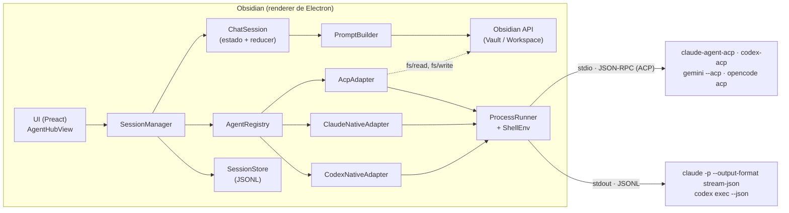
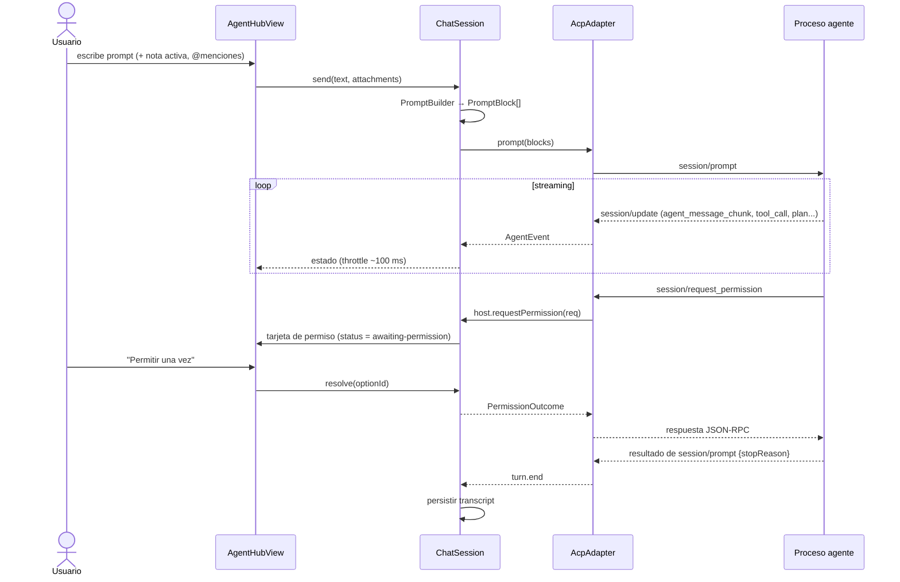

# AgentHub para Obsidian — Plan maestro

> **Documento vivo.** Es la fuente de verdad del proyecto: visión, requerimientos, arquitectura,
> tareas, decisiones y bitácora. Cualquier agente (Claude Code, Codex, Gemini, etc.) o persona
> que retome el trabajo debe **leer la §0 primero** y **actualizar este archivo al terminar**.

- **Nombre provisional:** AgentHub · **id del plugin:** `agenthub` (verificar que no esté tomado; ver §14)
- **Repositorio local:** `~/workspace/agenthub-plugin-obsidian`
- **Creado:** 2026-10-01
- **Idioma del código:** inglés (identificadores, comentarios). **Idioma de docs/UI:** español + inglés (i18n).

---

## Índice

0. [Estado actual y protocolo para retomar](#0-estado-actual-y-protocolo-para-retomar)
1. [Visión y objetivos](#1-visión-y-objetivos)
2. [Requerimientos](#2-requerimientos)
3. [Contexto técnico verificado](#3-contexto-técnico-verificado)
4. [Arquitectura](#4-arquitectura)
5. [Especificación de adaptadores](#5-especificación-de-adaptadores)
6. [Estructura del repositorio](#6-estructura-del-repositorio)
7. [Stack y dependencias](#7-stack-y-dependencias)
8. [Flujo de desarrollo](#8-flujo-de-desarrollo)
9. [Estrategia de pruebas](#9-estrategia-de-pruebas)
10. [Seguridad y privacidad](#10-seguridad-y-privacidad)
11. [Roadmap y tareas](#11-roadmap-y-tareas)
12. [Decisiones de arquitectura (ADR)](#12-decisiones-de-arquitectura-adr)
13. [Riesgos y mitigaciones](#13-riesgos-y-mitigaciones)
14. [Preguntas abiertas](#14-preguntas-abiertas)
15. [Convenciones y Definition of Done](#15-convenciones-y-definition-of-done)
16. [Glosario](#16-glosario)
17. [Bitácora](#17-bitácora)

---

## 0. Estado actual y protocolo para retomar

### 0.1 Estado (actualizar en cada sesión de trabajo)

| Campo | Valor |
|---|---|
| Fase actual | **Fase 6 — Pulido**: Fases 0–4 cerradas y verificadas; Fase 5 condicional (ADR-025); release **0.0.5 publicada** con mensajes destacados y autor `wh01s17` |
| Próxima tarea | Preparar **0.1.0** según §8.4: cerrar la revisión manual de T6.3/T6.6, probar instalación/actualización con BRAT, crear CHANGELOG.md y añadir capturas al README. Envío a la comunidad opcional. Fase 7 descartada (ADR-029). |
| Tareas en paralelo posibles | Publicación opcional en la comunidad (Q3); Fase 5 solo si aparece una limitación real de ACP (ADR-025). |
| Bloqueos | Ninguno |
| Última actualización | 2026-10-01 — Política §8.4 incorporada al README y al procedimiento; próximo hito 0.1.0, Codex |
| Código existente | Núcleo + ACP + UI + contexto de Obsidian (Fases 0–3 cerradas); guardado automático de sesiones con índice/JSONL, debounce, retención y ajustes de historial. Confirmación de modos sin restricciones, Codex en solo lectura y respaldo de opciones Gemini. Lint y build pasan; 198 tests pasan, 2 e2e omitidos. Rama `main`. |

### 0.2 Protocolo para un agente que retoma el trabajo

1. **Leer** este documento completo; como mínimo §0, §4, §11 y la última entrada de §17.
2. **Inspeccionar el repo:** `git status`, `git log --oneline -20`.
3. **Comprobar que todo está verde** antes de tocar nada:
   `pnpm install --frozen-lockfile && pnpm lint && pnpm test && pnpm build`.
   Si algo falla, arreglarlo es la primera tarea (registrarlo en la bitácora).
4. **Elegir la tarea:** la primera tarea sin marcar `[ ]` de la fase actual cuyas dependencias
   estén completas. No saltar de fase sin cerrar los criterios de aceptación de la anterior.
5. **Trabajar en pasos pequeños.** Commits con Conventional Commits que citen la tarea:
   `feat(acp): map tool_call updates to domain events [T2.5]`.
6. **Al terminar (o al detenerse a medias):**
   - Marcar `[x]` las tareas completadas (o anotar avance parcial dentro de la tarea).
   - Actualizar la tabla §0.1.
   - Añadir una entrada a la **Bitácora (§17)**: fecha, agente, qué se hizo, qué falta, bloqueos.
   - Si se tomó o cambió una decisión de arquitectura, **añadir un ADR nuevo** en §12
     (nunca editar en silencio uno existente: se marca como "Reemplazado por ADR-0xx").
   - Si se verificó un dato marcado con ⚠️, actualizar el texto y quitar la marca.
7. **No inventar formatos de protocolo.** Todo lo marcado con ⚠️ debe confirmarse contra la
   herramienta real (spikes de la Fase 1, `--help`, fixtures grabados) antes de codificarlo.

### 0.3 Leyenda

- ⚠️ = dato no verificado o que cambia con frecuencia; confirmar antes de depender de él.
- ✅ = verificado en este entorno (con fecha y versión).
- `[~]` = tarea con avance parcial (se indica qué falta).
- **Must/Should/Could** = prioridad MoSCoW.

---

## 1. Visión y objetivos

### 1.1 Problema

Los agentes de código por CLI (Claude Code, Codex, Gemini CLI, OpenCode…) son muy útiles para
trabajar sobre un vault de Obsidian (resumir, reorganizar, refactorizar notas, generar contenido,
mantener enlaces), pero obligan a salir de Obsidian a una terminal, perder el contexto de la nota
activa y revisar cambios fuera del editor.

### 1.2 Solución

Un plugin de Obsidian (escritorio) que **envuelve los agentes instalados en el sistema** y los
expone en una **vista lateral (sidebar)** tipo chat:

- Detecta qué agentes están disponibles y permite elegir uno por sesión.
- Lanza el agente como proceso hijo y habla con él por un **protocolo estructurado**
  (ACP — Agent Client Protocol — como vía principal; salida JSON nativa de cada CLI como vía directa).
- Renderiza respuestas con el motor Markdown de Obsidian, muestra llamadas a herramientas,
  diffs, planes y **solicitudes de permiso interactivas**.
- Inyecta contexto de Obsidian: nota activa, selección, notas mencionadas con `@`.
- Guarda historial de sesiones y permite reanudarlas o exportarlas como nota.

### 1.3 Objetivos

1. Usar Claude Code y Codex desde el sidebar con la misma calidad de experiencia que en la terminal
   para el 90 % de los casos de uso (chat, edición de archivos, comandos, permisos).
2. Arquitectura **agnóstica del agente**: añadir un agente nuevo compatible con ACP debe requerir
   solo configuración (comando + argumentos), sin código.
3. Seguridad por defecto: nada se ejecuta ni se escribe sin el modo de permisos que el usuario eligió.
4. Cumplir las guías de plugins de la comunidad de Obsidian para poder publicarlo.

### 1.4 No-objetivos (fuera de alcance)

- Soporte móvil (iOS/Android): imposible lanzar procesos. El plugin es `isDesktopOnly: true`.
- Implementar un agente propio o llamar directamente a APIs de LLM. El plugin **no** gestiona API keys
  ni hace llamadas de red propias: los agentes se autentican y conectan por su cuenta.
- Gestionar la instalación/actualización de los agentes (solo detectar y dar instrucciones).
- Emulación de terminal completa: fuera del alcance por decisión del usuario (ADR-029).

### 1.5 Escenarios de uso principales

1. "Resume esta nota y propón etiquetas" → contexto = nota activa → respuesta renderizada.
2. "Reorganiza las notas de `Proyectos/` en subcarpetas por año" → el agente pide permiso para
   mover/editar → el usuario aprueba → los cambios aparecen en el vault.
3. Selecciona un párrafo → comando "Enviar selección al agente" → "reescríbelo más claro".
4. Retoma ayer una sesión larga de Codex desde el historial y continúa.
5. Ejecuta un slash command del agente (p. ej. `/review`) desde el compositor.

---

## 2. Requerimientos

### 2.1 Funcionales

| ID | Requerimiento | Prioridad | Fase |
|---|---|---|---|
| RF-01 | Vista lateral (derecha por defecto) abrible desde icono de cinta y comando; se restaura al reiniciar Obsidian (estado de la vista persistido). | Must | 0 / 4 |
| RF-02 | Detección de agentes disponibles: binario encontrado, versión, adaptador ACP presente; estado visible (disponible / no instalado / error) con instrucciones de instalación. | Must | 2 |
| RF-03 | Selección de agente por sesión. Cambiar de agente crea una sesión nueva. | Must | 2 |
| RF-04 | Enviar prompts y recibir respuestas **en streaming**, renderizadas con el Markdown de Obsidian (wikilinks, código, callouts). | Must | 2 |
| RF-05 | Mostrar llamadas a herramientas (tipo, título, estado, entrada/salida colapsable) y planes/TODOs del agente. | Must | 2 |
| RF-06 | Solicitudes de permiso interactivas (permitir una vez / siempre / denegar) cuando el agente lo soporta; si no, modo de permisos configurable antes del turno. | Must | 2 / 5 |
| RF-07 | Cancelar el turno en curso (botón detener + comando). | Must | 2 |
| RF-08 | Contexto de Obsidian: nota activa (toggle), selección, menciones `@nota` con autocompletado. | Must | 3 |
| RF-09 | Slash commands del agente con autocompletado en el compositor. | Should | 3 |
| RF-10 | Historial: listar, reanudar, renombrar, borrar y exportar sesiones a una nota Markdown. | Should | 4 |
| RF-11 | Varias sesiones simultáneas (varios paneles AgentHub). | Should | 4 |
| RF-12 | Selector de modelo y de modo (p. ej. plan / acceptEdits) cuando el agente los expone. | Should | 2 / 5 |
| RF-13 | Mostrar uso (tokens / coste) cuando el agente lo reporta. | Could | 5 |
| RF-14 | Comandos de Obsidian: abrir, nueva sesión, detener, enviar selección, preguntar sobre nota actual, exportar. Sin hotkeys por defecto. | Must | 3 |
| RF-15 | Pestaña de ajustes: agentes (preset + personalizados), directorio de trabajo, contexto, historial, seguridad, debug. | Must | 2 |
| RF-16 | Directorio de trabajo: raíz del vault (defecto), carpeta de la nota activa, o ruta personalizada. | Must | 3 |
| RF-17 | Rutas de archivos y wikilinks en la salida son clicables y abren la nota en Obsidian. | Should | 3 |
| RF-18 | Vista de diffs para ediciones de archivos. | Should | 6 |
| RF-19 | Panel de depuración opcional con eventos crudos y stderr del agente. | Should | 2 |
| RF-20 | Agentes ACP personalizados definidos solo por configuración (comando, args, env). | Must | 2 |
| RF-21 | Modo terminal: TUI original del agente en el sidebar vía xterm.js. **Descartado por decisión del usuario (ADR-029).** | Fuera de alcance | 7 (cancelada) |

### 2.2 No funcionales

| ID | Requerimiento |
|---|---|
| RNF-01 | **Plataformas:** Linux y macOS soportados; Windows "best effort" (rutas `.cmd`, comillas). |
| RNF-02 | **Sin procesos huérfanos:** todo proceso hijo se termina al cerrar la sesión, la vista, o al descargar el plugin. |
| RNF-03 | **Rendimiento:** la UI sigue fluida con sesiones de 1000+ mensajes; el re-render del mensaje en streaming se limita (throttle ~100 ms). Carga del plugin < 100 ms (los agentes se lanzan de forma perezosa). |
| RNF-04 | **Privacidad:** sin telemetría, sin llamadas de red propias. Los transcripts se guardan solo en local. |
| RNF-05 | **Robustez de parsing:** tipos de evento desconocidos se ignoran (y se registran en debug), nunca rompen la sesión. |
| RNF-06 | **Cumplimiento de guías de Obsidian:** sin `innerHTML` con contenido no confiable, limpieza con `register*`, estilos con variables CSS, textos en *sentence case*, sin hotkeys por defecto. |
| RNF-07 | **Accesibilidad:** navegable por teclado, roles/aria en lista de mensajes y tarjetas, contraste del tema. |
| RNF-08 | **Temas:** compatible con temas claro/oscuro y temas de la comunidad (solo variables CSS de Obsidian). |
| RNF-09 | **Tamaño del bundle:** `main.js` objetivo < 1,5 MB minificado. |
| RNF-10 | **Mantenibilidad:** TypeScript `strict`, núcleo sin dependencias de UI, adaptadores testeables sin Obsidian. |

### 2.3 Restricciones de plataforma

- Obsidian corre en el *renderer* de Electron con integración Node: `child_process`, `fs`, `http`
  están disponibles **solo en escritorio**.
- Un plugin de la comunidad se distribuye solo como `main.js`, `manifest.json` y `styles.css`:
  **no se pueden distribuir módulos nativos** (p. ej. `node-pty`) ni binarios. Todo debe ir en el bundle JS.
- Las apps GUI no heredan el `PATH` del shell interactivo del usuario (crítico en este entorno: ver §3.1).
- Obsidian empaquetado como Flatpak/Snap está aislado y no puede lanzar binarios del host sin
  `flatpak-spawn --host`: se documenta como no soportado inicialmente.

---

## 3. Contexto técnico verificado

### 3.1 Entorno de desarrollo detectado ✅ (2026-10-01)

| Herramienta | Versión | Ruta |
|---|---|---|
| Obsidian | 1.13.7 (paquete Arch `obsidian`) | `/usr/bin/obsidian` |
| Node | v26.10.0 (mise) | `~/.local/share/mise/installs/node/latest/bin/node` |
| npm / pnpm | presentes | npm vía mise; pnpm vía nvm |
| Claude Code | 2.1.286 | `~/.local/share/mise/installs/claude/latest/claude` |
| Codex CLI | 0.159.3 | `~/.local/share/mise/installs/codex/latest/bin/codex` |
| Gemini CLI | 0.62.0 | `~/.local/share/mise/installs/gemini/latest/node_modules/.bin/gemini` |
| OpenCode | 1.18.34 | `~/.local/share/mise/installs/opencode/latest/opencode` |
| SO | Linux (Omarchy / Arch, Hyprland), shell zsh | — |

> **Actualizado tras S1** ✅: aunque los agentes están instalados con **mise**, Obsidian lanzado desde el lanzador
> de Hyprland **sí** los encuentra (la sesión de Omarchy incluye `~/.local/share/mise/shims` en el `PATH`). El shell
> de login tarda ≈1,4 s y resuelve otros binarios. La resolución de entorno (§4.7) sigue siendo necesaria para otros
> sistemas (macOS, escritorios sin esa configuración), pero como **respaldo perezoso**. Ver `docs/spikes/S1-env.md`.

### 3.2 API de Obsidian que usaremos

- `Plugin` (`onload`/`onunload`, `addRibbonIcon`, `addCommand`, `addSettingTab`, `registerView`,
  `registerEvent`, `registerDomEvent`, `registerInterval`, `loadData`/`saveData`).
- `ItemView` para el sidebar: `getViewType`, `getDisplayText`, `getIcon`, `onOpen`, `onClose`,
  `getState`/`setState` (para restaurar la sesión mostrada al reiniciar).
- Activación: `workspace.getLeavesOfType(TYPE)`; si no existe, `workspace.getRightLeaf(false)` +
  `leaf.setViewState({ type, active: true })` y `workspace.revealLeaf(leaf)` (async desde 1.7.2;
  con *deferred views* hay que tener en cuenta `leaf.loadIfDeferred()`).
- `MarkdownRenderer.render(app, markdown, el, sourcePath, component)` para renderizar respuestas.
- `FileSystemAdapter#getBasePath()` para la ruta absoluta del vault (comprobar `instanceof`).
- `Vault` (`read`, `cachedRead`, `process`/`modify`, `create`, `getAbstractFileByPath`),
  `Workspace` (`getActiveViewOfType(MarkdownView)`, `editor.getSelection()`, `openLinkText`),
  `prepareFuzzySearch` para el autocompletado de `@menciones`.
- `Platform.isDesktopApp`, `Notice`, `Modal`, `Setting`, `setIcon`, `Menu`, evento `editor-menu`.
- Guía oficial: `obsidian-sample-plugin` como plantilla y `eslint-plugin-obsidianmd` como linter.
- `minAppVersion`: **1.8.7** (necesario para `getLanguage()`, usado por i18n; ver ADR-011).

### 3.3 Agent Client Protocol (ACP)

Protocolo abierto (iniciado por Zed) para comunicar un **cliente** (editor) con un **agente** por
**JSON-RPC 2.0 sobre stdio** (NDJSON). Es exactamente el problema de este plugin. Sitio: `agentclientprotocol.com`.
SDK TypeScript: `@agentclientprotocol/sdk` (1.6.0 ✅ en npm, 2026-10-01).

Flujo esencial (✅ verificado en S2 con SDK 1.6.0 y 3 agentes reales; detalle en `docs/spikes/S2-acp.md`):

1. Cliente lanza el agente y llama `initialize` con `protocolVersion`, `clientCapabilities`
   (`fs.readTextFile`, `fs.writeTextFile`, `terminal`) y `clientInfo`.
   Respuesta: `agentCapabilities` (`loadSession`, `promptCapabilities{image,audio,embeddedContext}`,
   `mcpCapabilities{http,sse}`) y `authMethods`.
2. (Si hace falta) `authenticate({ methodId })`.
3. `session/new { cwd, mcpServers[] }` → `sessionId` (+ opcionalmente `modes`, `models`).
4. `session/prompt { sessionId, prompt: ContentBlock[] }` → al final `{ stopReason }`
   (`end_turn`, `max_tokens`, `max_turn_requests`, `refusal`, `cancelled`).
5. Durante el turno el agente envía notificaciones `session/update` con `sessionUpdate` ∈
   `user_message_chunk`, `agent_message_chunk`, `agent_thought_chunk`, `tool_call`,
   `tool_call_update`, `plan`, `available_commands_update`, `current_mode_update`.
6. El agente puede pedir al cliente: `session/request_permission` (opciones `allow_once`,
   `allow_always`, `reject_once`, `reject_always`), `fs/read_text_file`, `fs/write_text_file`,
   `terminal/*` (si se anunció la capacidad).
7. Cancelar: notificación `session/cancel`; los permisos pendientes se responden con `cancelled`.
8. Reanudar: `session/load` (si `loadSession`), que re-emite el historial como `session/update`.
9. Modos y modelos: **`configOptions`** en la respuesta de `session/new` (`category: 'mode'|'model'`,
   `type: 'select'`, `currentValue`, `options[]`), cambiados con `session/set_config_option`. Algunos agentes
   envían además `modes` (`session/set_mode`) y `models`. OpenCode solo usa `configOptions`.
10. Otros métodos del agente (SDK 1.6.0): `session/{list,delete,fork,resume,close}`, `logout`, `providers/*`.
    `sessionCapabilities` anuncia cuáles soporta cada agente.

**API del SDK 1.6.0** ✅: `ClientSideConnection` está **deprecado**. Usar el builder:
`acp.client({ name }).onRequest(acp.methods.client.session.requestPermission, (ctx) => …).connectWith(acp.ndJsonStream(input, output), async (ctx) => …)`;
`ctx.request(acp.methods.agent.initialize, …)`; `ctx.buildSession(cwd).start()` → `ActiveSession`
(`prompt()`, `nextUpdate()` → `session_update` | `stop`, `dispose()`).

**Diferencias observadas respecto a la especificación base** ✅ (S2):
- `sessionUpdate` adicionales: `usage_update` (`{used, size, cost?}` = uso de la ventana de contexto) y
  `session_info_update` (Codex).
- Los chunks traen `messageId` del agente.
- Contenido de tool calls envuelto: `{type:'content', content:{type:'text', text}}`; diffs `{type:'diff', path, oldText, newText}`.
- Claude crea el `tool_call` vacío (`rawInput: {}`) y lo completa con `tool_call_update`.
- Con `terminal: false`, Codex envía igualmente contenido `{type:'terminal', terminalId}` y la salida en
  `_meta.terminal_output_delta` / `_meta.terminal_exit`.
- **Ningún agente probado usa `fs/read_text_file` ni `fs/write_text_file`**: escriben directamente en disco.

`ContentBlock` del prompt: `text`, `resource_link` (uri a archivo), `resource` (contenido embebido,
requiere `embeddedContext`), `image`, `audio`.

`ToolCall`: `toolCallId`, `title`, `kind` (`read`, `edit`, `delete`, `move`, `search`, `execute`,
`think`, `fetch`, `other`), `status` (`pending`, `in_progress`, `completed`, `failed`),
`content[]` (texto, `diff {path, oldText, newText}`, terminal), `locations[]`, `rawInput`, `rawOutput`.

Agentes con ACP ✅ (2026-10-01):

| Agente | Comando ACP | Notas |
|---|---|---|
| Claude Code | `npx -y @agentclientprotocol/claude-agent-acp@0.85.0` | ✅ Reutiliza el login existente (sin API key). Pide permisos (`allow_once`, `allow_always`, `reject_once`). Modo por defecto `default` (Manual). ~20 s para la tarea de prueba. |
| Codex | `npx -y @agentclientprotocol/codex-acp@2.1.1` | ✅ Reutiliza el login de ChatGPT. Modo por defecto `agent` (*Auto review*: no pidió permisos para escribir). ~45 s. |
| Gemini CLI | `gemini --acp` | ⚠️ Handshake OK, pero con la cuenta personal de este equipo la sesión falla: *"no longer supported for Gemini Code Assist for individuals… migrate to Antigravity"*. Preset deshabilitado por defecto. |
| OpenCode | `opencode acp` | ✅ Nativo. No pidió permisos para escribir. Modelo vía `configOptions`. ~19 s. |

> Los paquetes antiguos `@zed-industries/claude-code-acp` y `@zed-industries/codex-acp` están
> **deprecados** ✅; no usarlos.

### 3.4 Claude Code CLI (modo directo) ✅ flags verificados en 2.1.286

- Modo no interactivo: `-p/--print`.
- `--output-format text|json|stream-json`; `--input-format text|stream-json` (streaming bidireccional por stdin).
- `--include-partial-messages` (deltas de texto; requiere `--print` + `stream-json`); `--verbose`
  ✅ **obligatorio** con `stream-json` (S3). El prompt puede ir por **stdin** ✅.
- Sesiones: `--session-id <uuid>` (fijar id al crear), `-r/--resume <id>`, `-c/--continue`, `--fork-session`.
- Permisos: `--permission-mode` ∈ `acceptEdits`, `auto`, `bypassPermissions`, `manual`, `dontAsk`, `plan`.
  `--permission-prompts host|none` (con `--print`: `host` = el host del SDK o `--permission-prompt-tool`
  responde; `none` = todo lo que pediría permiso se deniega automáticamente).
  `--permission-prompt-tool <mcp_tool>` existe (referenciado en la ayuda, no listado) ⚠️.
- Herramientas: `--tools`, `--allowedTools`, `--disallowedTools` (p. ej. `"Bash(git *)" Edit`).
- Contexto: `--append-system-prompt`, `--system-prompt`, `--add-dir`, `--mcp-config`, `--strict-mcp-config`,
  `--settings`, `--setting-sources`, `--model`, `--effort low|medium|high|xhigh|max`.
- Otros útiles: `--bare` (sin hooks/plugins), `--safe-mode`, `--replay-user-messages`, `--json-schema`.

Eventos de `stream-json` (✅ confirmados en S3, ver `docs/spikes/S3-claude-native.md`; además hay `system/hook_*`,
`system/commands_changed`, `system/status`, `system/thinking_tokens`, `system/permission_denied` en vivo y `rate_limit_event`): `system/init`
(session_id, model, tools, slash_commands, permissionMode, cwd), `assistant` (bloques `text`,
`thinking`, `tool_use`), `user` (bloques `tool_result`), `stream_event` (eventos crudos de la API
con `--include-partial-messages`), `result` (subtype, `is_error`, `result`, `session_id`,
`total_cost_usd`, `usage`, `num_turns`, `permission_denials`).

### 3.5 Codex CLI (modo directo) ✅ flags verificados en 0.159.3

- `codex exec [OPTIONS] [PROMPT]` — no interactivo. `PROMPT` = `-` lee de stdin.
- `--json` → eventos JSONL por stdout. `-o/--output-last-message <FILE>`.
- `-C/--cd <DIR>`, `--add-dir <DIR>`, `-m/--model`, `-i/--image`, `-c key=value` (overrides de config TOML),
  `-p/--profile`, `--skip-git-repo-check` (**necesario**: un vault normalmente no es repo git),
  `--ephemeral` (no persiste sesión), `--ignore-user-config`.
- Sandbox: `-s/--sandbox read-only|workspace-write|danger-full-access`.
  `--approve-for-me` (aprobaciones revisadas automáticamente dentro de workspace-write),
  `--dangerously-bypass-approvals-and-sandbox`.
- Reanudar: `codex exec [--json -s … --skip-git-repo-check] resume <SESSION_ID> -` ✅. **Las opciones de sandbox van antes de
  `resume`** (después no las acepta) y el directorio de trabajo es el `cwd` del proceso.
- `codex app-server` [experimental]: servidor JSON-RPC (`--listen stdio://` por defecto) usado por
  integraciones de IDE; soporta aprobaciones interactivas. `codex app-server generate-ts` genera los tipos TS.
- Eventos `--json` (✅ confirmados en S4 salvo `reasoning`/`todo_list`/`mcp_tool_call`/`web_search`, que no aparecieron): `thread.started{thread_id}`, `turn.started`,
  `item.started|item.updated|item.completed{item}` con `item.type` ∈ `agent_message`, `reasoning`,
  `command_execution`, `file_change`, `mcp_tool_call`, `web_search`, `todo_list`, `error`;
  `turn.completed{usage}`, `turn.failed{error}`, `error`.
- Limitación: `exec` no permite aprobaciones interactivas → para eso, ACP (`codex-acp`) o `app-server`.

### 3.6 Otros agentes ✅

- **Gemini CLI 0.62.0:** `--acp`; headless `-p` con `-o text|json|stream-json`;
  `--approval-mode default|auto_edit|yolo|plan`; `-r/--resume`.
- **OpenCode 1.18.34:** `opencode acp`; `opencode run --format json`; `opencode serve` (servidor HTTP headless).

### 3.7 Paquetes npm relevantes ✅ (versiones al 2026-10-01)

| Paquete | Versión | Uso |
|---|---|---|
| `obsidian` | 1.13.1 | Tipos de la API (devDependency). |
| `@agentclientprotocol/sdk` | 1.6.0 | Cliente ACP (`ClientSideConnection`, `ndJsonStream`). |
| `@agentclientprotocol/claude-agent-acp` | 0.85.0 | Adaptador ACP de Claude (lo instala el usuario o se usa vía `npx`). |
| `@agentclientprotocol/codex-acp` | 2.1.1 | Adaptador ACP de Codex. |
| `@anthropic-ai/claude-agent-sdk` | 0.3.287 | Alternativa evaluable (no prevista en el MVP). |
| `@openai/codex-sdk` | 0.159.3 | Alternativa evaluable (no prevista en el MVP). |
| `preact` | 11.0.0 | UI. |
| `eslint-plugin-obsidianmd` | 0.4.2 | Lint de guías de Obsidian. |
| `@xterm/xterm` | 6.0.0 | Referencia histórica; no se incorporará: Fase 7 descartada (ADR-029). |

### 3.8 Prior art a estudiar (⚠️ verificar estado actual antes de copiar patrones)

- **Agent Client** (plugin de Obsidian que usa ACP) — referencia directa del enfoque ACP en Obsidian.
- **Claudian** (Claude Code en el sidebar de Obsidian vía Claude Agent SDK).
- **obsidian-terminal** (polyipseity) — terminal en Obsidian; PTY sin módulos nativos (helper Python).
- **Zed** — cliente ACP de referencia (manejo de permisos, tool calls, diffs).
- Extensión de Codex para VS Code — consumidor de `codex app-server`.

Objetivo de estudiarlos: reutilizar ideas (no código sin revisar licencia) y diferenciarse
(multi-agente real, integración profunda con el vault, contexto `@`, export a notas).

---

## 4. Arquitectura

### 4.1 Vista general



Principio rector: **el modelo de dominio interno tiene la forma de ACP.** El `AcpAdapter` es
casi una traducción 1:1; los adaptadores nativos son "shims" que convierten la salida JSONL de cada
CLI a los mismos eventos. La UI y el resto del núcleo nunca conocen el formato de un agente concreto.

### 4.2 Capas y responsabilidades

| Capa | Módulos | Responsabilidad | Depende de |
|---|---|---|---|
| Plugin | `main.ts` | Ciclo de vida, registro de vista/comandos/ajustes, apagado de procesos. | todas |
| UI | `ui/` | Renderizar estado de sesión, capturar input, resolver permisos. | core (lectura), Obsidian |
| Core | `core/` | Modelo de dominio, `SessionManager`, `ChatSession`, `PromptBuilder`, `AgentRegistry`. | interfaces |
| Adaptadores | `adapters/` | Traducir protocolo de cada agente ↔ eventos de dominio. | process, core/types |
| Proceso | `process/` | Spawn, stdio, terminación de árbol, entorno/PATH, binarios. | Node |
| Persistencia | `storage/` | Índice y transcripts de sesiones, export a nota. | Obsidian adapter |
| Puente (fase 5) | `bridge/` | Servidor MCP local (permisos para Claude directo, herramientas del vault). | Node http |

Regla: `core/` y `adapters/` **no importan `obsidian`** (salvo tipos inyectados por interfaces),
para poder testearlos con Vitest sin Obsidian. Lo que necesitan de Obsidian llega por un
`HostBridge` inyectado (leer/escribir archivos del vault, ruta base, etc.).

### 4.3 Modelo de dominio (`src/core/types.ts`)

> **Implementado en T2.1.** El código de `src/core/types.ts` es la fuente de verdad; el bloque siguiente es
> orientativo y puede quedar desfasado en detalles (p. ej. `rawOutput` en `ToolCall`, `SessionStatus`).

```ts
export type AgentId = string; // 'claude-acp', 'codex-acp', 'gemini', 'opencode', 'claude-native', ...

export type ToolKind =
  | 'read' | 'edit' | 'delete' | 'move' | 'search' | 'execute' | 'think' | 'fetch' | 'other';
export type ToolStatus = 'pending' | 'in_progress' | 'completed' | 'failed';
export type StopReason =
  | 'end_turn' | 'max_tokens' | 'max_turn_requests' | 'refusal' | 'cancelled' | 'error';

export interface ToolCall {
  id: string;
  title: string;
  kind: ToolKind;
  status: ToolStatus;
  rawInput?: unknown;
  locations?: { path: string; line?: number }[];
  content?: ToolContent[];
}
export type ToolContent =
  | { type: 'text'; text: string }
  | { type: 'diff'; path: string; oldText: string | null; newText: string }
  | { type: 'terminal'; output: string; exitCode?: number };

export interface PlanEntry { content: string; status: 'pending' | 'in_progress' | 'completed'; priority?: 'high' | 'medium' | 'low' }
export interface SlashCommand { name: string; description?: string; inputHint?: string }
export interface ModeInfo { id: string; name: string; description?: string }
export interface ModelInfo { id: string; name: string }
export interface Usage {
  inputTokens?: number; outputTokens?: number; cachedInputTokens?: number;
  costUsd?: number;
  contextUsed?: number; contextSize?: number;          // ACP usage_update {used, size}
}
export interface ConfigOption {                         // ACP configOptions (modo, modelo, …)
  id: string; name: string; description?: string;
  category?: 'mode' | 'model' | string;
  currentValue: string;
  options: { value: string; name: string; description?: string }[];
}

export type AgentEvent =
  | { type: 'session.ready'; nativeSessionId: string; configOptions?: ConfigOption[]; modes?: ModeInfo[]; currentModeId?: string; models?: ModelInfo[]; currentModelId?: string }
  | { type: 'config'; configOptions: ConfigOption[] }
  | { type: 'message.chunk'; role: 'assistant' | 'user'; messageId: string; text: string } // messageId del agente si lo envía
  | { type: 'thought.chunk'; messageId: string; text: string }
  | { type: 'message.end'; messageId: string }
  | { type: 'tool.call'; call: ToolCall }
  | { type: 'tool.update'; id: string; patch: Partial<Omit<ToolCall, 'id'>> }
  | { type: 'plan'; entries: PlanEntry[] }
  | { type: 'commands'; commands: SlashCommand[] }
  | { type: 'mode'; currentModeId: string }
  | { type: 'usage'; usage: Usage }
  | { type: 'permission.denied'; toolName: string; input?: unknown } // modo directo sin prompts interactivos
  | { type: 'turn.end'; stopReason: StopReason }
  | { type: 'error'; message: string; recoverable: boolean; detail?: string }
  | { type: 'debug'; source: 'stdout' | 'stderr' | 'rpc'; line: string };

export type PromptBlock =
  | { type: 'text'; text: string }
  | { type: 'file'; path: string; absPath: string; text?: string }    // nota/archivo del vault
  | { type: 'selection'; path: string; text: string; fromLine: number; toLine: number }
  | { type: 'image'; mimeType: string; data: string };                  // base64

export interface PermissionRequest {
  id: string;
  toolCall: Pick<ToolCall, 'id' | 'title' | 'kind' | 'rawInput' | 'locations'>;
  options: { id: string; label: string; kind: 'allow_once' | 'allow_always' | 'reject_once' | 'reject_always' }[];
}
export type PermissionOutcome = { outcome: 'selected'; optionId: string } | { outcome: 'cancelled' };
```

Estado de UI (derivado por un *reducer* puro a partir de los eventos — testeable con fixtures):

```ts
export type TranscriptItem =
  | { kind: 'user'; id: string; blocks: PromptBlock[]; at: number }
  | { kind: 'assistant'; id: string; text: string; streaming: boolean }
  | { kind: 'thought'; id: string; text: string; streaming: boolean }
  | { kind: 'tool'; call: ToolCall }
  | { kind: 'plan'; entries: PlanEntry[] }
  | { kind: 'permission'; request: PermissionRequest; resolved?: PermissionOutcome }
  | { kind: 'notice'; level: 'info' | 'warning' | 'error'; text: string };

export interface SessionViewState {
  localId: string;                 // uuid local de AgentHub
  agentId: AgentId;
  nativeSessionId?: string;        // id del agente (para reanudar)
  title: string;
  cwd: string;
  status: 'idle' | 'starting' | 'running' | 'awaiting-permission' | 'error' | 'closed';
  items: TranscriptItem[];
  modes?: ModeInfo[]; currentModeId?: string;
  models?: ModelInfo[]; currentModelId?: string;
  commands: SlashCommand[];
  usage?: Usage;
}
```

### 4.4 Interfaz de adaptadores (`src/core/AgentAdapter.ts`)

> **Implementado en T2.1** (fuente de verdad: `src/core/AgentAdapter.ts`). Cambios respecto al bloque: modo y
> modelo se fijan con `SessionOptions.config` (`{ mode: 'plan' }`) y `AgentSession.setConfigOption()` (ADR-015),
> sin `setMode`/`setModel`; `AgentCapabilities` tiene `configOptions` en lugar de `modes`/`models`.

```ts
export interface Disposable { dispose(): void }

export interface HostBridge {
  vaultBasePath: string;
  env: () => Promise<NodeJS.ProcessEnv>;                         // entorno resuelto (§4.7)
  readTextFile(absPath: string, line?: number, limit?: number): Promise<string>;
  writeTextFile(absPath: string, content: string): Promise<void>; // vía Vault API si está dentro del vault
  requestPermission(req: PermissionRequest): Promise<PermissionOutcome>; // la UI lo resuelve
  log: Logger;
}

export interface AgentCapabilities {
  streaming: boolean;              // deltas de texto
  interactivePermissions: boolean;
  loadSession: boolean;            // reanudar con historial
  embeddedContext: boolean;        // acepta contenido de archivos embebido
  images: boolean;
  modes: boolean;
  models: boolean;
  slashCommands: boolean;
  usage: boolean;
}

export interface DetectionResult {
  status: 'available' | 'missing' | 'error';
  version?: string;
  resolvedCommand?: string;        // ruta absoluta del binario/comando
  message?: string;                // instrucciones si falta o falla
}

export interface SessionOptions {
  cwd: string;
  modeId?: string;
  modelId?: string;
  systemPromptAppend?: string;     // instrucciones del vault (§4.8)
  extraArgs?: string[];
  env?: Record<string, string>;
}

export interface AgentSession {
  readonly nativeSessionId: string | undefined; // puede llegar tras el primer turno (modo directo)
  readonly capabilities: AgentCapabilities;
  onEvent(listener: (e: AgentEvent) => void): Disposable;
  prompt(blocks: PromptBlock[]): Promise<StopReason>;
  cancel(): Promise<void>;
  setMode?(modeId: string): Promise<void>;
  setModel?(modelId: string): Promise<void>;
  setConfigOption?(id: string, value: string): Promise<void>; // preferido sobre setMode/setModel si existe
  dispose(): Promise<void>;        // mata el proceso, libera recursos
}

export interface AgentAdapter {
  readonly id: AgentId;
  readonly label: string;
  detect(host: HostBridge): Promise<DetectionResult>;
  createSession(opts: SessionOptions, host: HostBridge): Promise<AgentSession>;
  loadSession?(nativeSessionId: string, opts: SessionOptions, host: HostBridge): Promise<AgentSession>;
}
```

### 4.5 Flujo de un turno (ACP)



Cancelación: botón detener → `session.cancel()` → ACP `session/cancel`; los permisos pendientes se
resuelven con `cancelled`; si el agente no responde en 5 s, se mata el proceso y la sesión queda
reanudable (si `loadSession`) o se marca cerrada.

### 4.6 Gestión de procesos (`src/process/ProcessRunner.ts`)

- Lanzar con `cross-spawn` (manejo correcto de `.cmd` y comillas en Windows) o `child_process.spawn`
  en POSIX. `stdio: ['pipe','pipe','pipe']`, `cwd` de la sesión, `env` resuelto + env del agente.
- Variables añadidas por defecto: `NO_COLOR=1`, `FORCE_COLOR=0`, `TERM=dumb` (evitar ANSI en JSON).
  ⚠️ En S1 comprobar si heredar variables `ELECTRON_*`/`NODE_OPTIONS` del renderer causa problemas; si es así, filtrarlas.
- POSIX: `detached: true` para crear grupo de procesos y poder matar el árbol con
  `process.kill(-pid, 'SIGTERM')` → `SIGKILL` a los 3 s. Windows: `taskkill /PID <pid> /T /F`.
- **Registro global** de procesos vivos (`ProcessRegistry`): `onunload` del plugin y
  `window` `beforeunload` matan todos. Además, al cerrarse Obsidian la tubería stdin se cierra y los
  agentes ACP terminan por EOF.
- stdout: decodificación UTF-8 con `StringDecoder` (caracteres multibyte partidos entre chunks),
  separación por líneas (JSONL), límite de longitud de línea configurable (p. ej. 10 MB) para no reventar memoria.
- stderr: *ring buffer* de las últimas ~200 líneas para mostrar en errores y en el panel de debug.
- Para ACP: convertir stdio a web streams (`Writable.toWeb(stdin)`, `Readable.toWeb(stdout)`) y
  pasarlas a `ndJsonStream` del SDK.
- **Reaper de inactividad:** sesiones sin actividad durante `idleTimeoutMin` (defecto 15) liberan su
  proceso; se relanzan al enviar el siguiente prompt (vía `loadSession`/`--resume`).

### 4.7 Resolución de entorno y binarios (`src/process/ShellEnv.ts`, `BinaryResolver.ts`)

0. Resolver primero con `process.env` (S1: suficiente en este equipo). Solo si algún comando no se encuentra:
1. Ejecutar **de forma asíncrona** (≈1,4 s medidos en S1; nunca `spawnSync` en el hilo de la UI) y cachear el shell de login del usuario:
   `$SHELL -ilc 'printf "__AGH_START__"; env -0; printf "__AGH_END__"'` con timeout de 5 s.
   Los marcadores aíslan ruido de `.zshrc` (banners, prompts). Parsear `env -0` (separado por NUL).
2. Fusionar: `process.env`; las rutas del `PATH` del shell se **añaden al final** (no cambian qué binario gana si ya existía);
   `settings.env.extraPath` se antepone; luego el env del agente.
3. Si el shell falla o excede el timeout: usar `process.env` + rutas comunes:
   `~/.local/bin`, `~/.local/share/mise/shims`, `~/.local/share/mise/installs/*/latest{,/bin}`,
   `~/.npm-global/bin`, `~/.bun/bin`, `~/.cargo/bin`, `/usr/local/bin`, `/opt/homebrew/bin`,
   versiones de `~/.nvm` / `~/.config/nvm`.
4. `BinaryResolver.which(cmd, env)`: recorre `PATH` (y `PATHEXT` en Windows). Si el usuario configuró
   una ruta absoluta en ajustes, se usa tal cual.
5. Botón "Re-detectar agentes" en ajustes invalida la caché.
6. Windows: no se hace paso 1; se usa `process.env` (las GUI heredan el PATH de usuario).

### 4.8 Contexto de Obsidian → prompt (`src/core/PromptBuilder.ts`)

Entradas: texto del usuario, nota activa (si el toggle está activo), selección, `@menciones`,
imágenes pegadas (fase posterior), instrucciones del vault.

- **ACP:** `text` con el mensaje; cada nota → `resource_link` (`file:///abs/path`); la selección →
  `resource` embebido (`text/markdown`) si `embeddedContext`, si no → bloque de texto.
- **Modo directo (Claude/Codex):** todo se serializa como texto antes del mensaje:

```text
<obsidian-context>
Vault: /ruta/absoluta/al/vault   (directorio de trabajo)
Nota activa: Proyectos/Idea.md
Selección (Proyectos/Idea.md, líneas 10–24):
"""
…texto seleccionado…
"""
Notas referenciadas: Proyectos/A.md, Proyectos/B.md
</obsidian-context>

<mensaje del usuario>
```

- **Instrucciones del vault** (configurables, texto por defecto en ajustes): que es un vault de
  Obsidian, usar `[[wikilinks]]`, respetar frontmatter YAML, no tocar `.obsidian/`, preferir
  rutas relativas al vault. Claude directo → `--append-system-prompt`; ACP/Codex → se antepone en el
  **primer** prompt de la sesión como bloque de texto.
- Las rutas se pasan **relativas al vault** en el texto y **absolutas** en `resource_link`.
- Límite de tamaño de contexto embebido (p. ej. 200 KB) con aviso si se trunca.

### 4.9 Permisos

| Vía | Mecanismo | Fase |
|---|---|---|
| ACP | `session/request_permission` → tarjeta inline en el chat con las opciones del agente. "Siempre" lo gestiona el propio agente (la opción `allow_always`). | 2 |
| Claude directo (básico) | El usuario elige `--permission-mode` antes del turno; `--permission-prompts none`; las denegaciones (`permission_denials` del `result`) se muestran con botón "Permitir y reintentar" (relanza con `--allowedTools` añadido y `--resume`). | 5 |
| Claude directo (interactivo) | Servidor MCP local del plugin + `--permission-prompt-tool mcp__agenthub__approve` ⚠️. | 5 (opcional) |
| Codex directo | Selector de sandbox (`read-only` por defecto, `workspace-write`, `danger-full-access` con confirmación). Aprobaciones interactivas solo vía ACP o `app-server`. | 5 |

Reglas de UI: mientras haya un permiso pendiente, el estado es `awaiting-permission`, el compositor
sigue activo pero el botón principal muestra "Detener"; notificación (`Notice`) si la vista no es visible.
Modos peligrosos (`bypassPermissions`, `danger-full-access`, `agent-full-access`, `yolo`) piden confirmación explícita
cada vez que se activan y muestran un distintivo rojo en la cabecera. También se confirma al iniciar o
reanudar un proceso con un modo sin restricciones. Codex ACP inicia en `read-only` si no hay un modo
explícito en los ajustes (ADR-030). Cancelar no aplica el cambio; cerrar la sesión cierra el diálogo.

### 4.10 Persistencia (`src/storage/SessionStore.ts`)

```
<vault>/.obsidian/plugins/agenthub/
├── main.js · manifest.json · styles.css
├── data.json                    # ajustes (loadData/saveData)
└── sessions/
    ├── index.json               # [{localId, agentId, nativeSessionId, title, cwd, createdAt, updatedAt}]
    └── <localId>.jsonl          # transcript: 1 línea = {v:1, t, item}  (TranscriptItem consolidado)
```

- Se persisten **items consolidados** (mensajes completos, no cada chunk) para que los archivos sean pequeños.
- Escrituras con *debounce* (1 s) y al terminar cada turno; acceso vía `app.vault.adapter` (funciona en `.obsidian`).
- **T4.1 implementada:** se reemplaza el snapshot JSONL completo para consolidar también cambios en herramientas
  y planes. Escrituras serializadas con `.tmp` y respaldo `.bak`: `DataAdapter.rename()` no sobrescribe destinos;
  se restaura el respaldo si falla el reemplazo o al leer después de una interrupción (ADR-021).
  Un índice corrupto produce un error sin sobrescribirlo; registros JSONL inválidos se omiten con aviso.
  Los snapshots guardados no contienen streaming activo ni permisos pendientes accionables.
- La reanudación real del contexto del modelo la hace el **agente** (`session/load`, `--resume`,
  `codex exec resume`); el transcript local es para mostrar historial. Si el agente no puede reanudar,
  la sesión se abre en modo lectura con botón "Continuar en sesión nueva".
- Retención configurable (`maxSessions`, defecto 200). Opción para desactivar historial.
- Aviso en ajustes: si el vault se sincroniza (Sync/git), los transcripts se sincronizan también.
- **Export a nota:** Markdown con frontmatter (`agent`, `created`, `session`), mensajes como
  secciones y tool calls como callouts plegables (`> [!tool]- Read Proyectos/A.md`).

### 4.11 UI

```
┌──────────────────────────────────────┐
│ [● Claude Code ▾]  [+] [🕘] [⚙]       │ cabecera: agente/estado, nueva sesión, historial, ajustes
│ Refactor de notas de proyectos  ✎     │ título de sesión (editable)
├──────────────────────────────────────┤
│ Tú                                    │
│  Resume esta nota y propón etiquetas  │
│  📎 Proyectos/Idea.md                 │
│ Claude                                │
│  La nota describe…  (Markdown)        │
│ ▸ 🔍 Read  Proyectos/Idea.md      ✓   │ tarjeta de herramienta (colapsable)
│ ▸ ✏️ Edit  Proyectos/Idea.md  [diff]  │
│ ┌ ⚠ Permiso: ejecutar `git mv a b` ┐  │ tarjeta de permiso
│ │ [Permitir] [Siempre] [Denegar]   │  │
│ └──────────────────────────────────┘  │
│ ☐ Plan: 1 ✓ Leer · 2 ◐ Mover · 3 ○    │
├──────────────────────────────────────┤
│ [📄 Idea.md ×] [✂ Selección ×]         │ chips de contexto
│ ┌──────────────────────────────────┐ │
│ │ Escribe… (@ notas, / comandos)   │ │ compositor (textarea autoajustable)
│ └──────────────────────────────────┘ │
│ Modo [Default ▾] Modelo [▾]   [➤/■]  │
│ ● listo · 12,3k tokens · $0,04       │ barra de estado
└──────────────────────────────────────┘
```

- **Tecnología:** Preact montado en `contentEl` del `ItemView` (desmontar en `onClose`).
  Estado: `ChatSession` expone `subscribe/getSnapshot`; hook `useSessionState()`.
- **Markdown:** componente `<Markdown>` que usa `MarkdownRenderer.render` dentro de un `Component`
  hijo (se descarga al desmontar). Mientras hace streaming: re-render con throttle de ~100 ms.
  Interceptar clics en `a.internal-link` → `workspace.openLinkText(href, sourcePath)`.
- **Tarjetas de herramientas:** icono por `kind`, título, estado (spinner/✓/✗), entrada (JSON
  formateado o comando), salida truncada con "mostrar más"; rutas clicables si están dentro del vault.
- **Pensamiento (thinking):** colapsado por defecto (ajuste `showThoughts`).
- **Compositor:** `Enter` envía / `Shift+Enter` nueva línea (o `Mod+Enter` según ajuste);
  `@` abre sugeridor de archivos (fuzzy), `/` abre slash commands; historial de prompts con `↑`.
- **Lista de mensajes:** auto-scroll solo si el usuario está al final; botón "ir al final".
  Si el rendimiento lo exige (sesiones muy largas), virtualizar en Fase 6.
- **Sin `innerHTML`**: usar JSX/`createEl`; todo texto de agentes se trata como no confiable.
- CSS: clases con prefijo `agenthub-`, solo variables de Obsidian (`--background-secondary`,
  `--text-muted`, `--interactive-accent`, …).

### 4.12 Ajustes (`src/settings/settings.ts`)

```ts
export interface AgentConfig {
  id: string;                      // único
  label: string;
  enabled: boolean;
  transport: 'acp' | 'claude-native' | 'codex-native';
  command: string;                 // 'npx', 'gemini', '/ruta/absoluta', ...
  args: string[];
  env: Record<string, string>;     // ⚠️ se guarda en data.json en texto plano: avisar en la UI
  defaultModelId?: string;
  defaultModeId?: string;          // permission mode / approval mode / sandbox según transporte
  extraArgs?: string[];            // solo modo directo
}

export interface AgentHubSettings {
  schemaVersion: 1;
  defaultAgentId: string;
  agents: AgentConfig[];           // presets (§5.4) + personalizados
  cwdMode: 'vault' | 'active-note-folder' | 'custom';
  customCwd?: string;
  context: { includeActiveNoteByDefault: boolean; maxEmbeddedBytes: number };
  vaultInstructions: string;
  composer: { sendWith: 'enter' | 'mod-enter' };
  env: { resolveLoginShell: boolean; extraPath: string[] };
  history: { enabled: boolean; maxSessions: number; exportFolder: string };
  ui: { showThoughts: boolean; autoExpandTools: boolean; debugPanel: boolean };
  processes: { idleTimeoutMin: number };
  security: { protectConfigDir: boolean; allowWritesOutsideVault: boolean };
}
```

- `loadSettings()` aplica migraciones por `schemaVersion` (función `migrate(raw): AgentHubSettings`, con tests).
- Los presets se fusionan con lo guardado (si llega un preset nuevo en una versión del plugin, aparece deshabilitado).

### 4.13 Comandos de Obsidian

| id (sin prefijo del plugin) | Nombre |
|---|---|
| `open-view` | Open AgentHub |
| `new-session` | New session |
| `stop-turn` | Stop current turn |
| `send-selection` | Send selection to agent (también en menú contextual del editor) |
| `ask-about-note` | Ask about current note |
| `switch-agent` | Switch agent (SuggestModal) |
| `export-session` | Export session to note |
| `open-history` | Open session history |

Sin hotkeys por defecto (guía de Obsidian); los usuarios las asignan.

### 4.14 Manejo de errores

| Situación | Detección | Respuesta en UI |
|---|---|---|
| Binario no encontrado | `BinaryResolver` / `ENOENT` en spawn | Estado "no instalado" + comando de instalación + enlace a ajustes para ruta manual. |
| No autenticado | ACP `auth_required` / texto de error conocido / código de salida | Aviso con instrucción (`claude` → `/login`, `codex login`, `gemini` → login) o `authenticate` ACP si hay método. |
| Proceso muere | evento `exit` con código ≠ 0 durante un turno | Tarjeta de error con últimas líneas de stderr + botón "Reintentar" (relanza y reanuda). |
| Línea JSON inválida | `JSON.parse` falla | Se ignora, se registra en debug; nunca rompe la sesión. |
| Evento desconocido | tipo no mapeado | Evento `debug`; no se muestra al usuario. |
| Timeout de arranque | sin `initialize`/`init` en 30 s | Error con stderr; matar proceso. |
| Escritura fuera del vault (ACP fs) | guardia de rutas | Rechazo JSON-RPC con mensaje claro; aviso en UI. |

### 4.15 Logging y debug

- `Logger` con niveles (`error|warn|info|debug`), prefijo `[AgentHub]`, nivel según ajuste.
- Panel de debug (opcional) en la vista: eventos crudos (stdout/stderr/RPC) de la sesión actual, con botón copiar.
- Nunca registrar el contenido de variables de entorno (pueden contener secretos).

---

## 5. Especificación de adaptadores

### 5.1 `AcpAdapter` (genérico, transporte principal)

1. `detect()`: resolver `command` (si es `npx`, comprobar `npx` y, si existe el binario global del
   adaptador — p. ej. `claude-agent-acp` ⚠️ nombre del bin —, preferirlo por velocidad). Versión vía
   `--version` cuando aplique.
2. `createSession()`:
   - spawn → `acp.client({ name: 'agenthub' }).onRequest(…).connectWith(ndJsonStream(...), …)` (`ClientSideConnection` está deprecado).
   - `initialize({ protocolVersion, clientCapabilities: { fs: { readTextFile: true, writeTextFile: true }, terminal: false }, clientInfo: { name: 'agenthub', version } })`.
   - Guardar `agentCapabilities` → mapear a `AgentCapabilities`.
   - `session/new({ cwd, mcpServers: [] })` (en Fase 5, añadir el servidor MCP del plugin si `mcpCapabilities.http`).
   - Emitir `session.ready` con `configOptions` (y `modes`/`models` si llegan).
3. `clientImpl`:
   - `sessionUpdate(n)` → mapear (tabla abajo) y emitir.
   - `requestPermission(p)` → `host.requestPermission()`; responder `{ outcome }`.
   - `readTextFile({path, line, limit})` → si está en el vault y hay un editor abierto con cambios sin
     guardar, devolver el contenido del editor; si no, `vault.read`. Fuera del vault: solo si está en `--add-dir` permitidos.
   - `writeTextFile({path, content})` → guardia de rutas (vault + dirs permitidos; `.obsidian/` bloqueado si
     `protectConfigDir`); dentro del vault usar `vault.process`/`create` (así Obsidian actualiza editores abiertos).
   - `terminal/*` → no anunciado en MVP (el agente ejecuta comandos por su cuenta).
4. `prompt()` → `connection.prompt({ sessionId, prompt })` → `turn.end`.
5. `cancel()` → `connection.cancel({ sessionId })` + resolver permisos pendientes con `cancelled`.
6. `loadSession()` → solo si `agentCapabilities.loadSession`.

Mapeo `session/update` → `AgentEvent`:

| `sessionUpdate` | Evento de dominio |
|---|---|
| `agent_message_chunk` (content text) | `message.chunk` (role assistant) |
| `user_message_chunk` | `message.chunk` (role user) — solo durante `session/load` |
| `agent_thought_chunk` | `thought.chunk` |
| `tool_call` | `tool.call` |
| `tool_call_update` | `tool.update` |
| `plan` | `plan` |
| `available_commands_update` | `commands` |
| `current_mode_update` | `mode` |
| `usage_update` | `usage` (`contextUsed`, `contextSize`, `costUsd` si `cost.currency` = USD) |
| `session_info_update` | `debug` (estado del hilo; sin UI por ahora) |
| `_meta.terminal_output_delta` / `terminal_exit` en `tool_call_update` | `tool.update` con `content: [{type:'terminal', output, exitCode}]` acumulado |
| desconocido | `debug` |

El `messageId` se toma del chunk si viene (todos los agentes probados lo envían); si no, se genera. Un mensaje del asistente termina (`message.end`) cuando llega
un evento de otro tipo (tool_call, plan…) o `turn.end`.

### 5.2 `ClaudeNativeAdapter` (modo directo, Fase 5)

Un proceso **por turno** (simple y robusto); la continuidad la da `--session-id`/`--resume`.

```bash
# primer turno (sessionId generado por el plugin)
claude -p --output-format stream-json --verbose --include-partial-messages \
  --session-id <uuid> --permission-mode <modo> --permission-prompts none \
  [--model <m>] [--append-system-prompt "<instrucciones vault>"] [--add-dir ...] [extraArgs]
# prompt por stdin ✅ (evita límites/escapado de argumentos); --verbose es obligatorio ✅

# turnos siguientes
claude -p ... --resume <uuid>
```

Mapeo (✅ fixtures en `tests/fixtures/claude/`):

| stream-json | Evento de dominio |
|---|---|
| `system` / `init` | `session.ready` (session_id, comandos de `slash_commands`, modo) |
| `stream_event` → `content_block_delta.text_delta` | `message.chunk` |
| `stream_event` → `thinking_delta` | `thought.chunk` |
| `assistant` bloque `text` | si no hubo parciales: `message.chunk` completo; luego `message.end` |
| `assistant` bloque `tool_use` | `tool.call` (`kind` por nombre: `Read`→read; `Edit`/`Write`/`MultiEdit`/`NotebookEdit`→edit; `Bash`→execute; `Grep`/`Glob`→search; `WebFetch`/`WebSearch`→fetch; `TodoWrite`→**plan**; `Task`/`mcp__*`→other) |
| `user` bloque `tool_result` | `tool.update` (status completed/failed según `is_error`, contenido) |
| `system` / `permission_denied` (en vivo) | `permission.denied` |
| `result` | `usage` (`total_cost_usd`, `usage`) + `turn.end` (`success`→`end_turn`; `error_max_turns`→`max_turn_requests`; otros errores→`error`) |

Mejora posible (evaluar): proceso persistente con `--input-format stream-json` (menos latencia por turno).

### 5.3 `CodexNativeAdapter` (modo directo, Fase 5)

```bash
codex exec --json --skip-git-repo-check -C <cwd> -s <sandbox> [-m <modelo>] [--add-dir ...] -   # prompt por stdin
cd <cwd> && codex exec --json --skip-git-repo-check -s <sandbox> resume <thread_id> -   # ✅ opciones ANTES de `resume`
```

Mapeo (✅ fixtures en `tests/fixtures/codex/`):

| Evento `--json` | Evento de dominio |
|---|---|
| `thread.started` | `session.ready` (`thread_id` → nativeSessionId) |
| `item.started` `command_execution` | `tool.call` (execute, in_progress, título = comando) |
| `item.completed` `command_execution` | `tool.update` (completed/failed por `exit_code`, salida agregada) |
| `item.*` `file_change` | `tool.call`/`tool.update` (edit, `locations` = rutas cambiadas) |
| `item.*` `mcp_tool_call` / `web_search` | `tool.call`/`tool.update` (other / fetch) |
| `item.*` `todo_list` | `plan` |
| `item.completed` `agent_message` | `message.chunk` (texto completo) + `message.end` |
| `item.completed` `reasoning` | `thought.chunk` + fin |
| `turn.completed` | `usage` + `turn.end(end_turn)` |
| `turn.failed` / `error` | `error` + `turn.end(error)` |

Nota: `exec` no emite deltas de texto → la respuesta aparece completa (capacidad `streaming: false`).

### 5.4 Presets de agentes (incluidos en ajustes por defecto)

| id | label | transport | command | args |
|---|---|---|---|---|
| `claude-acp` | Claude Code | acp | `npx` | `-y @agentclientprotocol/claude-agent-acp` |
| `codex-acp` | Codex | acp | `npx` | `-y @agentclientprotocol/codex-acp` |
| `gemini` | Gemini CLI (deshabilitado por defecto, ver §3.3) | acp | `gemini` | `--acp` |
| `opencode` | OpenCode | acp | `opencode` | `acp` |
| `claude-native` | Claude Code (directo) | claude-native | `claude` | — |
| `codex-native` | Codex (directo) | codex-native | `codex` | — |

- Fijar versiones de los adaptadores en los presets (p. ej. `@agentclientprotocol/claude-agent-acp@0.85`)
  para evitar roturas por actualizaciones; actualizar deliberadamente.
- Recomendar instalación global para evitar la latencia de `npx` en el primer arranque:
  `npm i -g @agentclientprotocol/claude-agent-acp @agentclientprotocol/codex-acp`.

---

## 6. Estructura del repositorio

```
agenthub-plugin-obsidian/
├── plan.md                         # este documento (fuente de verdad)
├── AGENTS.md / CLAUDE.md           # punteros breves a plan.md + comandos clave
├── README.md                       # para usuarios finales
├── LICENSE
├── manifest.json                   # id, name, version, minAppVersion, isDesktopOnly: true
├── versions.json                   # versión del plugin → minAppVersion
├── package.json
├── tsconfig.json
├── esbuild.config.mjs              # bundle cjs, externals: obsidian, electron, @codemirror/*, @lezer/*, builtins
├── vitest.config.ts                # alias 'obsidian' → tests/__mocks__/obsidian.ts
├── eslint.config.mjs               # eslint-plugin-obsidianmd + typescript-eslint
├── styles.css
├── .github/workflows/ci.yml        # lint + test + build
├── .github/workflows/release.yml   # en tag: build y release con main.js, manifest.json, styles.css
├── src/
│   ├── main.ts                     # AgentHubPlugin
│   ├── constants.ts                # VIEW_TYPE, ids
│   ├── i18n/                       # es.ts, en.ts, t()
│   ├── settings/
│   │   ├── settings.ts             # tipos, defaults, presets, migrate()
│   │   └── SettingsTab.ts
│   ├── core/
│   │   ├── types.ts                # §4.3
│   │   ├── AgentAdapter.ts         # §4.4
│   │   ├── AgentRegistry.ts        # presets → adaptadores, detección cacheada
│   │   ├── ChatSession.ts          # orquesta un AgentSession + estado + permisos pendientes
│   │   ├── reducer.ts              # (state, event) → state, puro
│   │   ├── SessionManager.ts       # crea/reanuda/cierra sesiones, reaper de inactividad
│   │   ├── PromptBuilder.ts        # §4.8
│   │   └── HostBridgeImpl.ts       # implementación con Obsidian (única pieza de core que importa obsidian)
│   ├── process/
│   │   ├── ProcessRunner.ts
│   │   ├── ProcessRegistry.ts
│   │   ├── LineDecoder.ts          # JSONL robusto
│   │   ├── ShellEnv.ts
│   │   └── BinaryResolver.ts
│   ├── adapters/
│   │   ├── acp/AcpAdapter.ts, mapping.ts, pathGuard.ts
│   │   ├── claude-native/ClaudeNativeAdapter.ts, args.ts, parser.ts, toolKinds.ts
│   │   ├── codex-native/CodexNativeAdapter.ts, args.ts, parser.ts
│   │   └── fake/FakeAdapter.ts     # en memoria, para UI/tests
│   ├── bridge/                     # Fase 5: servidor MCP local
│   ├── storage/
│   │   ├── SessionStore.ts
│   │   └── exportToNote.ts
│   ├── ui/
│   │   ├── AgentHubView.ts         # ItemView que monta Preact
│   │   ├── App.tsx
│   │   ├── components/             # Header, MessageList, AssistantMessage, Markdown, ToolCallCard,
│   │   │                           # PermissionCard, PlanView, Composer, ContextChips, StatusBar, HistoryPanel, DebugPanel
│   │   ├── hooks/                  # useSessionState, useThrottledValue
│   │   └── suggest/                # FileMentionSuggest, SlashCommandSuggest
│   └── utils/                      # logger, paths, throttle, ids
├── tests/
│   ├── __mocks__/obsidian.ts
│   ├── fixtures/acp/<agente>/*.jsonl
│   ├── fixtures/claude/*.jsonl
│   ├── fixtures/codex/*.jsonl
│   ├── unit/*.test.ts
│   └── integration/*.test.ts       # con fake-acp-agent; e2e reales tras AGENTHUB_E2E=1
├── scripts/
│   ├── fake-acp-agent.mjs          # agente ACP simulado con escenarios
│   ├── record-fixture.sh           # graba salidas reales de CLIs a tests/fixtures
│   ├── link-test-vault.mjs         # enlaza el build a test-vault/.obsidian/plugins/agenthub
│   └── version-bump.mjs
├── docs/
│   ├── spikes/S1-env.md … S5-render.md
│   └── adr/                        # ADR largos si no caben en §12
└── test-vault/                     # vault de desarrollo (notas de ejemplo; .obsidian parcialmente ignorado)
```

---

## 7. Stack y dependencias

| Área | Elección | Motivo |
|---|---|---|
| Lenguaje | TypeScript `strict` | Estándar de plugins de Obsidian. |
| Bundler | esbuild (formato `cjs`, target `es2022`) | Plantilla oficial; rápido. |
| UI | Preact + JSX (`jsxImportSource: preact`) | API tipo React (familiar para agentes), ~10 KB. |
| Protocolo | `@agentclientprotocol/sdk` | Cliente ACP oficial. |
| Spawn | `cross-spawn` | Portabilidad Windows (`.cmd`, comillas). |
| Diffs | `diff` (jsdiff) | Diff unificado para la vista de cambios (Fase 6). |
| Tests | Vitest + jsdom + `@testing-library/preact` | Rápido, ESM, buen soporte TS. |
| Lint/format | ESLint (flat config) + `eslint-plugin-obsidianmd` + Prettier | Cumplir guías de revisión. |
| Node de desarrollo | ≥ 22 (instalado v26) | — |
| Gestor de paquetes | **pnpm** (12.3.4, fijado en `packageManager`) | Preferencia del usuario (ADR-013). No usar npm/yarn en el repo. |

Dependencias que **no** se usan: `node-pty` (nativo, no distribuible), React completo (tamaño),
librerías de estado pesadas.

---

## 8. Flujo de desarrollo

### 8.1 Primer setup

```bash
cd ~/workspace/agenthub-plugin-obsidian
pnpm install
pnpm build                    # genera main.js
pnpm link-vault   # symlink de main.js/manifest.json/styles.css a test-vault/.obsidian/plugins/agenthub/
```

Abrir `test-vault/` en Obsidian (abrir carpeta como vault), activar plugins de la comunidad y
habilitar AgentHub. Instalar el plugin **Hot Reload** (pjeby) en el vault de pruebas y crear
`test-vault/.obsidian/plugins/agenthub/.hotreload` para recargar en cada build.

### 8.2 Scripts de `package.json`

| Script | Acción |
|---|---|
| `dev` | esbuild en modo watch (sourcemaps inline) → salida enlazada al vault de pruebas. |
| `build` | `tsc --noEmit` + esbuild producción (minificado). |
| `test` / `test:watch` | Vitest. |
| `test:e2e` | Tests contra CLIs reales (`AGENTHUB_E2E=1`; consumen tokens: no en CI). |
| `lint` / `lint:fix` | ESLint. |
| `format` | Prettier. |
| `fake-agent` | Ejecuta `scripts/fake-acp-agent.mjs` para pruebas manuales (`pnpm fake-agent --scenario tools`). |
| `version` | `version-bump.mjs`: sincroniza `manifest.json` y `versions.json`. |

### 8.3 Depuración

- DevTools de Obsidian: `Ctrl+Shift+I`. Filtrar consola por `[AgentHub]`.
- Para simular el entorno real de lanzamiento (sin PATH de mise), arrancar Obsidian desde el lanzador
  de Hyprland, no desde una terminal.
- Agente simulado: añadir en ajustes un agente ACP personalizado con
  `command: node`, `args: [<ruta>/scripts/fake-acp-agent.mjs, --scenario, permissions]`.

### 8.4 Versionado y releases

**Esquema: SemVer `MAJOR.MINOR.PATCH`**, igual en `package.json`, `manifest.json` y `versions.json`. El **tag de git es
exactamente la versión, sin prefijo `v`** (Obsidian y BRAT lo exigen; `release.yml` falla si no coincide con el manifest).

**Mientras la versión sea 0.x (desarrollo inicial):**

| Sube | Cuándo | Ejemplos |
|---|---|---|
| **MINOR** (`0.X.0`) | Funcionalidad nueva visible para el usuario, cambio de comportamiento, cambio en el formato de ajustes o sesiones guardadas (con migración), o subida de `minAppVersion`. | Historial, exportar a nota, ajustes buscables, nuevo agente soportado. |
| **PATCH** (`0.x.Y`) | Solo arreglos, ajustes visuales, rendimiento o documentación, sin funciones nuevas. | Arreglar "Starting the agent…", animación de los puntos, color de un logo. |

**Hitos:**

- **0.1.0 — primera versión funcionalmente completa.** Fases 0–4 y 6 cerradas y verificadas en Obsidian
  (Fases 0–4 hechas; cierre manual de Fase 6 pendiente), más:
  `CHANGELOG.md` creado, capturas en el README y la instalación desde la release probada con BRAT. Es la versión que
  sigue a 0.0.5.
- **1.0.0 — versión estable.** Aceptada en la tienda de plugins de la comunidad de Obsidian, con el formato de ajustes y
  de sesiones guardadas estable (todo cambio posterior lleva migración).

**Desde 1.0.0:** **MAJOR** si rompe compatibilidad (datos o ajustes sin migración, subida de `minAppVersion` que deja
fuera a usuarios, quitar una función), **MINOR** para funciones nuevas compatibles, **PATCH** para arreglos.

**Pre-releases** para probar con BRAT antes de publicar: `0.2.0-beta.1`, `0.2.0-beta.2`… publicadas en GitHub como
*pre-release* (no *Latest*).

**`versions.json`:** cada versión publicada se añade con su `minAppVersion`; nunca se borran entradas.

**Procedimiento** (lo ejecuta un agente; **publicar requiere la confirmación del usuario**, porque es visible para otros):

1. `main` limpio y sincronizado con `origin`; `pnpm lint && pnpm test && pnpm build` en verde.
2. Decidir MINOR o PATCH con la tabla anterior y añadir la entrada en `CHANGELOG.md` (formato *Keep a Changelog*:
   Añadido / Cambiado / Corregido).
3. Cambiar la versión en `package.json` y ejecutar `npm_package_version=X.Y.Z node scripts/version-bump.mjs`
   (actualiza `manifest.json` y `versions.json`). **No usar `pnpm version`**: crea el tag con prefijo `v`.
4. Commit `chore(release): X.Y.Z`, tag anotado `git tag -a X.Y.Z -m "AgentHub X.Y.Z"`, push de `main` y del tag.
5. El workflow `release.yml` valida, compila y crea el **borrador** con `main.js`, `manifest.json` y `styles.css`.
6. Con la confirmación del usuario: `gh release edit X.Y.Z --draft=false --latest`, con las notas del `CHANGELOG.md`.
   Para una beta: `gh release edit X.Y.Z-beta.N --draft=false --prerelease --latest=false`.
7. Anotar la release en la bitácora (§17).

**Historial:** 0.0.1 (scaffolding, sin release) · 0.0.2 (tag; borrador eliminado) · 0.0.3, 0.0.4 y 0.0.5 publicadas.
La numeración 0.0.x se preparó sin esta regla; desde aquí se aplica. La próxima release es **0.1.0**.

**Tienda de la comunidad (camino a 1.0.0):** PR a `obsidianmd/obsidian-releases` añadiendo el plugin a
`community-plugins.json`.

---

## 9. Estrategia de pruebas

| Nivel | Qué | Cómo |
|---|---|---|
| Unitarias | `LineDecoder`, `ShellEnv` (parseo `env -0`), `BinaryResolver`, `PromptBuilder`, `reducer`, parsers Claude/Codex, `mapping` ACP, `pathGuard`, `migrate()` de ajustes | Vitest, sin Obsidian (mock en `tests/__mocks__/obsidian.ts`). |
| Contrato | Parsers contra **fixtures grabados de CLIs reales** (una carpeta por versión del CLI) | Si un CLI cambia de formato, se graba un fixture nuevo y el test indica qué rompió. |
| Integración | `AcpAdapter` ↔ `fake-acp-agent.mjs` (texto en streaming, tool calls, permisos, plan, cancelación, crash del agente, auth requerida) | Proceso real, sin red, sin coste. |
| UI | Componentes clave (`ToolCallCard`, `PermissionCard`, `Composer`) | `@testing-library/preact` + jsdom. |
| E2E manual | Checklist en `test-vault` con cada agente real | Ver lista abajo; se ejecuta antes de cada release. |
| E2E automatizado (opcional) | Prompts mínimos contra CLIs reales | `pnpm test:e2e`, nunca en CI. |

**Checklist manual de release** (por agente disponible): abrir vista · detectar agente · enviar
prompt · streaming visible · tool call visible · permiso aprobado y denegado · cancelar a mitad ·
reanudar sesión tras reiniciar Obsidian · `@mención` · selección · export a nota · cerrar vista y
comprobar que no quedan procesos (`pgrep -fa 'claude|codex|gemini|opencode|acp'`) · tema claro/oscuro.

**Escenarios del `fake-acp-agent`** (`--scenario`): `echo`, `stream-long` (20 KB en chunks),
`tools`, `permissions`, `plan`, `slow` (para cancelar), `crash`, `auth-required`, `load-session`.

---

## 10. Seguridad y privacidad

1. **El agente tiene el poder, no el plugin.** Claude/Codex pueden editar archivos y ejecutar
   comandos con los permisos del usuario. El plugin debe: usar modos conservadores por defecto
   (Claude `manual`/permisos interactivos, Codex `read-only`), exigir confirmación para modos
   peligrosos y recomendar en el README tener el vault bajo git o con copia de seguridad.
2. **Guardia de rutas** solo cubre el canal `fs/*` de ACP (el agente puede escribir por sus propias
   herramientas): documentarlo honestamente. Bloquear `.obsidian/` por defecto en ese canal.
3. **Contenido no confiable:** toda salida de agentes se renderiza con `MarkdownRenderer` o como
   texto; nunca `innerHTML`. Los enlaces externos se abren con el comportamiento estándar de Obsidian.
4. **Secretos:** el plugin no pide API keys. Si el usuario define variables de entorno por agente,
   se avisa que `data.json` se guarda en texto plano (y puede sincronizarse). No registrar env en logs.
5. **Servidor MCP local (Fase 5):** escuchar solo en `127.0.0.1`, puerto aleatorio, token aleatorio
   por sesión exigido en cabecera/URL; apagarlo con el plugin.
6. **Sin telemetría ni red propia.** Declararlo en el README (requisito de la revisión de Obsidian),
   junto con el uso de procesos externos y la condición de solo escritorio.
7. **Inyección de prompts desde notas:** el contenido del vault puede contener instrucciones
   maliciosas; por eso los permisos interactivos importan. Mencionarlo en el README.

---

## 11. Roadmap y tareas

> Cada tarea: ID, descripción, dependencias, criterio de aceptación (CA). Marcar `[x]` al completar.

### Fase 0 — Fundaciones

- [x] **T0.1** `git init`, `.gitignore` (node_modules, main.js, data.json, test-vault/.obsidian/*
  excepto lo necesario), licencia (por decidir, §14), README mínimo. *CA:* repo con primer commit.
- [x] **T0.2** Scaffolding: `package.json`, `tsconfig.json` (strict, `jsx: react-jsx`,
  `jsxImportSource: preact`), `esbuild.config.mjs`, `manifest.json` (`isDesktopOnly: true`,
  `minAppVersion: 1.8.7`), `versions.json`, `styles.css`. *CA:* `pnpm build` genera `main.js`.
- [x] **T0.3** Calidad: ESLint (`eslint-plugin-obsidianmd`), Prettier, Vitest con mock de `obsidian`,
  un test trivial. *CA:* `pnpm lint && pnpm test` en verde.
- [x] **T0.4** `test-vault/` con notas de ejemplo + `scripts/link-test-vault.mjs` + script `dev`.
  *CA:* el plugin aparece y se habilita en el vault de pruebas.
- [x] **T0.5** Vista lateral vacía: `registerView`, icono de cinta, comando `open-view`,
  activación en hoja derecha, `getState/setState`, montaje/desmontaje de Preact con un "Hola".
  *CA:* abrir/cerrar la vista repetidas veces sin errores ni fugas; se restaura al reiniciar.
- [x] **T0.6** `AGENTS.md` y `CLAUDE.md` (breves: "lee plan.md §0", comandos de build/test).
- [x] **T0.7** CI de GitHub Actions (lint + test + build) — si hay remoto. *CA:* pipeline verde.

**Criterio de salida F0:** plugin cargable con sidebar vacío; lint/test/build verdes.

### Fase 1 — Spikes de validación (pueden ir en paralelo con F0; resultado en `docs/spikes/`)

- [x] **S1 Entorno** — Desde la consola de DevTools de Obsidian lanzado desde el lanzador de
  Hyprland: `require('child_process').spawnSync('claude',['--version'])` con `process.env` vs con el
  entorno de `$SHELL -ilc 'env -0'`. Medir el tiempo del shell de login. Revisar variables `ELECTRON_*`.
  *CA:* estrategia de §4.7 confirmada o ajustada.
- [x] **S2 ACP** — Script Node mínimo con `@agentclientprotocol/sdk` que haga `initialize` →
  `session/new` → `prompt` ("lee README.md y crea notas/prueba.md") contra `gemini --acp`,
  `opencode acp`, `claude-agent-acp` y `codex-acp`. Grabar todo el tráfico JSON-RPC en
  `tests/fixtures/acp/<agente>/`. Confirmar: capacidades, `authMethods`, uso de `fs/*` del cliente,
  forma de `request_permission`, `loadSession`, modos/modelos, y que Claude/Codex reutilizan el login
  existente (suscripción) sin API key. *CA:* §3.3 y §5.1 actualizados sin ⚠️ críticos.
- [x] **S3 Claude directo** — Grabar fixtures `stream-json`: texto simple, con `Read`, con edición
  denegada (`--permission-prompts none`), con `--resume`, con `--include-partial-messages`.
  Confirmar si `-p` lee el prompt de stdin y si `--verbose` es obligatorio. *CA:* §3.4/§5.2 confirmados.
- [x] **S4 Codex directo** — Grabar fixtures `exec --json` fuera de un repo git
  (`--skip-git-repo-check`), con comando, con `file_change`, y `exec resume` con prompt por stdin.
  *CA:* §3.5/§5.3 confirmados.
- [x] **S5 Render** — En el vault de pruebas, medir `MarkdownRenderer.render` re-renderizando un
  mensaje de 20 KB cada 100 ms. *CA:* decidir throttle y si hace falta render incremental.

### Fase 2 — Núcleo + ACP (MVP)

- [x] **T2.1** `core/types.ts` y `core/AgentAdapter.ts` según §4.3–4.4. *CA:* compila; sin `any`.
- [x] **T2.2** `ShellEnv` + `BinaryResolver` + tests. *Dep:* S1. *CA:* resuelve `claude`, `codex`,
  `gemini`, `opencode`, `npx` en este equipo lanzando Obsidian desde el lanzador gráfico.
- [x] **T2.3** `ProcessRunner` + `ProcessRegistry` + `LineDecoder` + tests (con scripts de prueba que
  emiten JSONL partido, UTF-8 multibyte, líneas enormes, y que ignoran SIGTERM).
  *CA:* ningún proceso huérfano tras `dispose()`/`onunload`.
- [x] **T2.4** `scripts/fake-acp-agent.mjs` con los escenarios de §9. *Dep:* S2.
- [x] **T2.5** `AcpAdapter` (§5.1) + `mapping.ts` + `pathGuard.ts` + tests de integración con el fake.
  *Dep:* T2.1–T2.4. *CA:* todos los escenarios del fake pasan.
- [x] **T2.6** `reducer.ts` + `ChatSession` + `SessionManager` (sin persistencia aún) + tests con fixtures.
- [x] **T2.7** `AgentRegistry` + presets (§5.4) + `SettingsTab` (lista de agentes, estado de
  detección, editar comando/args/env, agente por defecto, agentes personalizados). Los ajustes leídos de `data.json`
  se validan con un esquema (Zod, ya incluido por el SDK de ACP, o Valibot) dentro de `migrate()`. *CA:* RF-02, RF-15, RF-20.
- [x] **T2.8** UI: `Header` (selector de agente + estado), `MessageList`, `AssistantMessage` +
  `Markdown` (throttle), `ToolCallCard`, `PermissionCard`, `PlanView`, `Composer` (enviar/detener),
  `StatusBar`, `DebugPanel`. `onunload` llama a `ProcessRegistry.killAll()` (con test). Accesibilidad (skill
  `accessibility`): todo control es un `<button>`/`<select>`/`<textarea>` nativo con etiqueta, foco visible, objetivos
  ≥ 24×24 px, operable solo con teclado, avisos de estado y streaming en región `aria-live="polite"`, sin animaciones
  sin `prefers-reduced-motion`. Dirección visual según ADR-018. *CA:* RF-04, RF-05, RF-06 (ACP), RF-07, RF-19.
- [x] **T2.9** Selector de modo/modelo cuando el agente los expone. *CA:* RF-12 para ACP.
- [x] **T2.10** Manejo de errores de §4.14 (binario faltante, auth, crash, timeout).

**Criterio de salida F2 (MVP):** desde el sidebar, con **Claude (ACP)** y **Codex (ACP)** —y Gemini/OpenCode
si están disponibles—: enviar un prompt, ver la respuesta en streaming renderizada, ver tool calls,
aprobar y denegar un permiso, cancelar un turno; al cerrar la vista o desactivar el plugin no quedan procesos.

### Fase 3 — Integración con Obsidian (contexto)

- [x] **T3.1** `PromptBuilder` (§4.8) + tests (ACP y texto). *CA:* RF-08 (lógica).
- [x] **T3.2** Chips de contexto: nota activa (toggle, sigue a la hoja activa), selección. *CA:* RF-08 (UI).
- [x] **T3.3** Sugeridor `@` de archivos (fuzzy con `prepareFuzzySearch`, carpetas incluidas).
- [x] **T3.4** Sugeridor `/` alimentado por `available_commands_update`. *CA:* RF-09.
- [x] **T3.5** Comandos (§4.13) + entrada en menú contextual del editor ("Enviar selección a AgentHub"). *CA:* RF-14.
- [x] **T3.6** Rutas y wikilinks clicables en mensajes y tool cards. *CA:* RF-17.
- [x] **T3.7** Modos de directorio de trabajo + instrucciones del vault configurables. *(Hecho: raíz del vault, carpeta de la
  nota actual y carpeta personalizada + instrucciones con `{{configDir}}`.)* *CA:* RF-16.

### Fase 4 — Persistencia e historial

- [x] **T4.1** `SessionStore` (índice + JSONL, debounce, retención) + tests. Guardado conectado a
  `SessionManager` y cierre de vistas/plugin; ajustes `historyEnabled` y `maxSessions` (defecto 200).
  Verificado en Obsidian 1.13.7 con agente simulado, dos turnos, cierre y controles de ajustes.
- [x] **T4.2** Panel de historial (listar, buscar, renombrar, borrar, reanudar). Reanudar con
  `loadSession` si existe; si no, modo lectura + "Continuar en sesión nueva". *CA:* RF-10.
- [x] **T4.3** Restaurar la sesión mostrada en cada vista al reiniciar Obsidian (`getState/setState`). *CA:* RF-01.
- [x] **T4.4** Export de sesión a nota (§4.10). *CA:* nota válida con callouts plegables.
- [x] **T4.5** Múltiples vistas/sesiones simultáneas + reaper de inactividad. *CA:* RF-11; procesos liberados tras `idleTimeoutMin`.

### Fase 5 — Opcional / condicional: adaptadores directos (sin adaptadores ACP)

> **No se implementa salvo que ocurra un disparador (ADR-025).** ACP ya cubre Claude, Codex y OpenCode con permisos
> interactivos, streaming, reanudación y opciones. El trabajo previo (spikes S3/S4, fixtures en `tests/fixtures/claude`
> y `tests/fixtures/codex`, §5.2–5.3) queda listo para retomarla. **Disparadores:**
> 1. El adaptador ACP de Claude o Codex se rompe, se abandona o queda muy atrás respecto al CLI.
> 2. Hace falta funcionar sin Node/npm (`npx` no disponible).
> 3. Se necesita una función del CLI que ACP no expone.

- [ ] **T5.1** `ClaudeNativeAdapter` + parser + tests con fixtures S3. *Dep:* S3.
- [ ] **T5.2** `CodexNativeAdapter` + parser + tests con fixtures S4. *Dep:* S4.
- [ ] **T5.3** UX de permisos en modo directo: selector de modo de Claude, denegaciones con
  "Permitir y reintentar", selector de sandbox de Codex con confirmación para modos peligrosos.
- [x] **T5.4** Uso/coste en la barra de estado (Claude `result`, Codex `turn.completed`, ACP si lo reporta). *CA:* RF-13.
- [ ] **T5.5** *(Opcional)* `bridge/`: servidor MCP HTTP local (127.0.0.1 + token) con herramienta
  `approve` (para `--permission-prompt-tool`) y herramientas del vault (`get_active_note`,
  `search_vault`, `open_note`), inyectado en ACP (`mcpServers`) y en Claude (`--mcp-config`).
- [ ] **T5.6** *(Opcional)* Adaptador `codex app-server` (tipos con `generate-ts`) para aprobaciones
  interactivas sin `codex-acp`.

### Fase 6 — Pulido y publicación

- [x] **T6.1** Vista de diffs (jsdiff) para `ToolContent.diff` y `file_change`; botón "abrir archivo". *CA:* RF-18.
- [x] **T6.2** i18n es/en completo; textos en *sentence case*.
- [~] **T6.3** *(axe-core y pruebas de teclado/foco, temas claro/oscuro, zoom 200 % y emulación de alto contraste/movimiento reducido realizadas; falta lector de pantalla y alto contraste nativo; ver `docs/release-0.0.5.md`)* Accesibilidad (teclado, aria, foco tras enviar/permiso) y revisión de temas, siguiendo la checklist
  manual de la skill `accessibility` (teclado, lector de pantalla, zoom 200 %, alto contraste, movimiento reducido,
  orden de foco, tamaño de objetivos).
- [x] **T6.4** Rendimiento: virtualización de la lista si S5/uso real lo exige; medir carga del plugin.
- [x] **T6.5** README completo (capturas, requisitos, instalación de adaptadores, seguridad, privacidad).
- [x] **T6.7** Pestaña de ajustes con la API declarativa `getSettingDefinitions()` (buscable en Obsidian 1.13+) y `display()` como respaldo para versiones anteriores; `minAppVersion` se mantiene en 1.8.7 (ADR-027).
- [~] **T6.6** *(release **0.0.5** publicada con los 3 archivos y autor wh01s17; BRAT 2.2.0 verificó instalación 0.0.3 y actualización a 0.0.4. Falta comprobar la actualización a 0.0.5 y cerrar la checklist manual; envío a comunidad opcional)* Workflow de release + BRAT + checklist manual (§9) + envío a la comunidad.

- [x] **T6.8** Confirmación explícita y aviso rojo para modos sin restricciones; Codex ACP en solo lectura por defecto (ADR-030).
- [x] **T6.9** Mostrar y cambiar modelo/modo de agentes ACP que anuncian `models`/`modes` sin `configOptions` (Gemini 0.62); no fabricar opciones de esfuerzo ausentes (ADR-031).

- [x] **T6.10** Mensajes del usuario con etiqueta «Tú»/«You», tarjeta de fondo propio, borde de acento y espacio entre turnos; estilos del tema de Obsidian.

### Fase 7 — Descartada: modo terminal

**Fuera del alcance por decisión del usuario (ADR-029).** Estas tareas quedan canceladas y no cuentan como pendientes.

- **T7.1 — Cancelada:** spike de PTY sin módulos nativos y redimensionado de la terminal.
- **T7.2 — Cancelada:** vista con `@xterm/xterm` que ejecuta la TUI original del agente (RF-21).

---

## 12. Decisiones de arquitectura (ADR)

| ID | Decisión | Motivo | Alternativas descartadas | Estado |
|---|---|---|---|---|
| ADR-001 | Plugin solo escritorio, TypeScript + esbuild, estructura de `obsidian-sample-plugin`. | Necesita `child_process`; estándar del ecosistema. | Móvil (imposible lanzar procesos). | Aceptada |
| ADR-002 | **ACP como protocolo principal** de integración; el modelo de dominio interno replica ACP. | Un solo cliente cubre Claude, Codex, Gemini, OpenCode y futuros agentes; permisos interactivos, streaming, tool calls y diffs estandarizados. | Un adaptador ad-hoc por agente como única vía (más código, permisos pobres). | Aceptada |
| ADR-003 | Adaptadores directos (Claude `stream-json`, Codex `exec --json`) como vía secundaria en Fase 5. | Funcionan con los binarios ya instalados, sin adaptadores npm extra. | Hacerlos el MVP (peores permisos; dos parsers frágiles antes de tener núcleo). | Aceptada |
| ADR-004 | UI con Preact + `MarkdownRenderer` de Obsidian; prohibido `innerHTML`. | Ergonomía tipo React con bundle pequeño; render nativo de Markdown (wikilinks, temas). | React (tamaño), Svelte (menos familiar para agentes), DOM manual (inmantenible). | Aceptada |
| ADR-005 | Un proceso de agente por sesión activa; reaper de inactividad; matar árbol de procesos al cerrar. | Aislamiento de fallos, `cwd` por sesión, sin huérfanos. | Una conexión ACP compartida multiplexando sesiones (fallo de una afecta a todas). | Aceptada |
| ADR-006 | Resolver el entorno con el shell de login + rutas comunes + ruta manual. | Agentes instalados con mise/nvm no están en el PATH de apps GUI. | Exigir al usuario rutas absolutas (mala UX). | Aceptada |
| ADR-007 | Transcripts locales en JSONL dentro de la carpeta del plugin; la reanudación del contexto la hace el agente. | Mostrar historial sin depender de formatos internos de cada agente. | Leer los logs nativos de `~/.claude` / `~/.codex` (frágil, privado). | Aceptada |
| ADR-008 | Sin módulos nativos (`node-pty`); modo terminal pospuesto a Fase 7. | Los plugins de la comunidad solo distribuyen JS. | `node-pty` empaquetado (ABI de Electron, no distribuible). | Matizada por ADR-029: modo terminal descartado; se mantiene la exclusión de módulos nativos |
| ADR-009 | Las escrituras `fs/write_text_file` de ACP pasan por la Vault API con guardia de rutas. | Obsidian refresca editores abiertos; control de `.obsidian/`. | Escritura directa con `fs` (desincroniza editores). | Aceptada |
| ADR-010 | Fijar versiones de adaptadores ACP en los presets. | Los adaptadores evolucionan rápido (p. ej. renombres de paquetes). | `@latest` (roturas silenciosas). | Aceptada |
| ADR-011 | `minAppVersion` 1.8.7 (antes 1.7.2). | `getLanguage()` (i18n) existe desde 1.8.7; el entorno usa 1.13.7. | Leer el idioma de `localStorage` (no documentado). | Aceptada |
| ADR-014 | Los agentes escriben directamente en disco (S2); el refresco de editores depende del watcher de Obsidian. Se siguen anunciando y sirviendo `fs/*` (con guardia), pero la protección real del vault es el **modo de permisos** del agente. | Ningún agente probado usa `fs/*` del cliente. | Forzar escrituras por `fs/*` (no está en nuestra mano). | Aceptada (matiza ADR-009) |
| ADR-015 | Modo y modelo se exponen en la UI a partir de `configOptions` (`session/set_config_option`); `modes`/`models` solo como respaldo. | Es lo único común a Claude, Codex y OpenCode. | Selectores separados por `modes`/`models` (OpenCode quedaría sin selector). | Aceptada |
| ADR-016 | Usar el builder `acp.client()` del SDK 1.6, no `ClientSideConnection`. | `ClientSideConnection` está deprecado. | API deprecada. | Aceptada |
| ADR-017 | `PATH`: `process.env` primero; shell de login solo como respaldo asíncrono y cacheado, añadiendo rutas al final. | S1: en este equipo `process.env` ya encuentra todo; el shell cuesta ≈1,4 s y cambia el binario elegido. | Fusionar siempre el entorno del shell (lento y cambia binarios). | Aceptada (matiza ADR-006) |
| ADR-018 | La skill `frontend-design` se aplica solo en su principio (dirección visual intencional y coherente), no en su estética "audaz" (fuentes propias, fondos con texturas, paletas propias). | Las guías de Obsidian exigen respetar el tema del usuario: solo variables CSS de Obsidian, sin fuentes impuestas. | Seguir la skill al pie de la letra (rompería temas y la revisión de la comunidad). | Aceptada |
| ADR-019 | La pestaña de ajustes usa `PluginSettingTab.display()` (deprecado en Obsidian 1.13) en lugar de la API declarativa `getSettingDefinitions()`. | La API nueva exige `minAppVersion` ≥ 1.13; mantener 1.8.7 de momento. El lint lo marca como aviso. | Subir ya `minAppVersion` a 1.13 (excluye usuarios en versiones anteriores). | Reemplazada por ADR-027 |
| ADR-020 | `AgentRegistry` vive en `src/agents/` (capa de composición), no en `src/core/`. | Construye adaptadores concretos; en `core/` invertiría la dependencia núcleo → adaptadores. | `core/AgentRegistry.ts` (plan original). | Aceptada |
| ADR-021 | `SessionStore` recibe un subconjunto estructural de `DataAdapter` y guarda snapshots JSONL completos, serializados, con `.tmp` y respaldo `.bak` recuperable. El núcleo lo conecta mediante `SessionManager.onCreate`. | Herramientas y planes cambian después de insertarse; snapshots evitan duplicados. Verificado en Obsidian 1.13.7: `rename()` rechaza destinos existentes. El respaldo conserva la versión anterior durante el reemplazo. | Append de cada snapshot (duplicación); usar `fs.rename` directamente (acoplamiento a disco); asumir que `DataAdapter.rename` sobrescribe. | Aceptada |
| ADR-022 | Reabrir una sesión guardada usa `session/resume` si el agente lo anuncia; si no, `session/load` ignorando la repetición del historial (ya está en el transcript local); si no, sesión nueva con aviso `contextNotRestored`. | El transcript local es la fuente de lo que se muestra; el agente solo necesita recuperar su contexto. S2: Claude, Codex y OpenCode anuncian `resume`. | Usar siempre `session/load` (duplicaría el historial). | Aceptada |
| ADR-023 | Identidad por agente: monograma + color de la paleta del tema (`--color-orange`, `--color-green`…): Claude naranja «C», Codex verde «Cx», Gemini azul «G», OpenCode morado «O»; los personalizados, color estable por hash del id e iniciales. Sin logotipos de marca. | Distinguir de un vistazo qué agente se usa, respetando temas claro/oscuro (ADR-018). | Logotipos oficiales (restricciones de marca, no se adaptan al tema). | Matizada por ADR-028 (los agentes conocidos usan su logo) |
| ADR-024 | El agente arranca en segundo plano al mostrar una sesión (no con el primer mensaje), para que modo/modelo/esfuerzo se elijan **antes** de conversar. Mientras arranca se muestran las opciones que anunció al iniciar la última vez (`knownConfigOptions` en `data.json`, solo valores iniciales: un modo peligroso nunca queda fijado); un cambio hecho antes o durante el arranque se aplica al iniciar. Arrancar no bloquea el envío. | Pedido del usuario: configurar antes de iniciar la conversación. | Arranque perezoso (las opciones no aparecían hasta el primer mensaje). | Aceptada — revisar consumo con el reaper (T4.5) |
| ADR-025 | La Fase 5 (adaptadores directos `stream-json` / `exec --json`) pasa a **opcional y condicional**, con tres disparadores (adaptador ACP roto o abandonado, entorno sin Node/npm, función del CLI ausente en ACP). | ACP ya da todo lo necesario con mejores permisos y streaming; dos formatos extra que mantener no compensan hoy. Se conserva la investigación (S3/S4). | Implementarla ya (coste de una fase para una segunda vía a lo mismo); borrarla (perder el trabajo previo y la salida de emergencia). | Aceptada (decidido con el usuario) |
| ADR-026 | El Markdown de los agentes se renderiza **por bloques** (párrafos fuera de bloques de código) y con una **cola de ≤ 8 ms por tarea**. | S5 en Obsidian real: renderizar el mensaje entero bloqueaba la UI hasta 603 ms; con bloques + cola, 0 tareas largas y 33 ms de hueco máximo. | Renderizar entero con throttle (bloqueos visibles); texto plano durante el streaming (pierde formato mientras escribe). | Aceptada |
| ADR-027 | Ajustes definidos una vez como secciones y filas: `getSettingDefinitions()` los entrega a Obsidian 1.13+ (aparecen en su buscador; las filas de detalle por agente con `searchable: false`) y `display()` dibuja las mismas filas en versiones anteriores; cambios de estructura con `update()` (1.13+) o `display()`. **`minAppVersion` sigue en 1.8.7.** | La documentación de 1.13 indica que `display()` no se llama si hay definiciones y recomienda conservarlo para versiones antiguas: no hace falta excluir usuarios. Verificado en Obsidian 1.13.7 real. | Subir `minAppVersion` a 1.13 (excluye usuarios sin necesidad). | Aceptada (reemplaza ADR-019) |
| ADR-028 | Los agentes conocidos (Claude, Codex, Gemini, OpenCode) se identifican con su **logo original en su color**; los personalizados conservan el monograma de color (ADR-023). SVG de Lobe Icons (MIT) convertidos a datos (`src/ui/logos.ts`) y dibujados con Preact sin `innerHTML`, con ids de degradado únicos por instancia. | Pedido del usuario; reconocer cada herramienta de un vistazo. Uso solo identificativo de las marcas (habitual en integraciones). OpenAI/Codex no está en Simple Icons; Lobe Icons tiene los cuatro. | Monogramas (menos reconocibles); Simple Icons (sin Codex). | Aceptada |
| ADR-029 | La Fase 7 (modo terminal), T7.1, T7.2 y RF-21 quedan fuera del alcance y cancelados. | El usuario decidió que no realizará la Fase 7. | Mantener el modo terminal como tarea opcional pendiente. | Aceptada (decidido por el usuario; matiza ADR-008) |
| ADR-030 | Codex ACP usa `read-only` por defecto; las opciones explícitas prevalecen. Confirmación por activación/inicio/reanudación de los cuatro modos sin restricciones y distintivo rojo; rechazo o cierre bloquean el cambio. | Resolver Q8 y cumplir §10 y §4.9 también al restaurar sesiones. | Mantener Auto review como valor implícito; confiar solo en el selector. | Aceptada; resuelve Q8 |
| ADR-031 | Normalizar `modes`/`models` ACP antiguos a `ConfigOption` cuando falta su equivalente moderno. Cambios mediante `session/set_mode` y `session/set_model`; `configOptions` tiene prioridad. | Gemini 0.62 real anuncia estas opciones y no ofrece esfuerzo por ACP. | Inventar una lista de modelos/esfuerzos; usar `set_config_option` con agentes que no lo implementan. | Aceptada; completa ADR-015 |
| ADR-013 | **pnpm** como gestor de paquetes; config en `pnpm-workspace.yaml` (`allowBuilds: esbuild`, `strictPeerDependencies: false`); lockfile `pnpm-lock.yaml`. | Preferencia del usuario. | npm (usado al inicio, reemplazado). | Aceptada |
| ADR-012 | TypeScript 6.0.x (no 7) y ESLint 9 (no 10); `strictPeerDependencies: false` en `pnpm-workspace.yaml`. | `typescript-eslint` 8.71 exige TS < 6.1; `eslint-plugin-obsidianmd` 0.4.2 exige ESLint ≥ 9 y declara `obsidian@1.8.7` como peer exacto. Vitest 5 necesita `vite` explícito. | Seguir los peers exactos (tipos de Obsidian antiguos). | Aceptada |

---

## 13. Riesgos y mitigaciones

| Riesgo | Prob. | Impacto | Mitigación |
|---|---|---|---|
| ACP y sus adaptadores cambian rápido (SDK 1.x, adaptadores renombrados en 2026) | Alta | Medio | Versiones fijadas (ADR-010), tests de contrato con fixtures, negociación de `protocolVersion`, mapeo tolerante. |
| Formatos `stream-json`/`--json` de los CLIs cambian | Alta | Medio | Parsers tolerantes, fixtures por versión, adaptadores directos como vía secundaria. |
| Agentes que escriben sin pedir permiso en su modo por defecto (Codex `agent`, OpenCode) | Alta | Alto | Mostrar el modo activo siempre; Q8; recomendar git/backup. |
| PATH/entorno en apps GUI (mise/nvm/asdf) | Media (S1: no ocurre en este equipo) | Alto | §4.7 desde el MVP + ruta manual + botón re-detectar. |
| Obsidian en Flatpak/Snap | Media | Alto | Documentar no soportado; investigar `flatpak-spawn --host` más adelante. |
| Agente modifica una nota que el usuario está editando | Media | Medio | Escrituras ACP vía Vault API; aviso si el archivo está abierto con cambios sin guardar. |
| Agente destructivo en modo permisivo | Baja | Alto | Defaults conservadores, confirmación de modos peligrosos, recomendación de git/backup. |
| Procesos huérfanos | Media | Medio | `ProcessRegistry`, kill de grupo, EOF de stdin, prueba en checklist. |
| Coste/consumo de tokens inesperado | Media | Medio | Mostrar uso/coste; e2e reales fuera de CI. |
| Revisión de la comunidad rechaza algo (procesos externos) | Baja | Medio | Cumplir guías, `isDesktopOnly`, divulgación en README; hay precedentes de plugins que lanzan procesos. |
| Latencia de `npx` en el primer arranque | Alta | Bajo | Detectar binario global; mensaje "instalando adaptador…"; recomendar `npm i -g`. |
| Vulnerabilidad moderada en `moment` (GHSA-4p3w-j4w9-5jqw), vía el paquete de tipos `obsidian` | Baja | Bajo | No se incluye en el bundle (`obsidian` es externo). Revisar al actualizar `obsidian`. |
| Rendimiento con transcripts largos | Media | Medio | Throttle, items consolidados, virtualización (T6.4). |

---

## 14. Preguntas abiertas

| # | Pregunta | Supuesto actual (hasta que se decida) |
|---|---|---|
| Q1 | Nombre e `id` definitivos (¿"AgentHub" / `agenthub` libre en `community-plugins.json`?). | AgentHub / `agenthub`. |
| Q2 | Licencia. | MIT. |
| Q3 | ¿Publicar en la tienda de la comunidad o uso personal/BRAT? | Diseñar para publicar; decidir en Fase 6. |
| Q4 | ¿Prioridad de agentes para el MVP? | Claude Code y Codex (vía ACP); Gemini/OpenCode "gratis" por ACP. |
| Q5 | ¿Idioma principal de la UI? | Inglés por defecto + español completo (sigue el idioma de Obsidian). |
| Q6 | ¿Se requiere el modo directo si ACP funciona bien en S2? | Resuelta: Fase 5 condicional, solo ante una limitación real (ADR-025). |
| Q8 | Codex por ACP arranca en modo `agent` (*Auto review*) y escribe sin pedir permiso; OpenCode tampoco pide. ¿AgentHub debe forzar un modo más conservador al crear la sesión (p. ej. `read-only` / `workspace-write` en Codex)? | Resuelta por ADR-030: Codex ACP en `read-only` salvo configuración explícita; modos sin restricciones con confirmación y aviso. |
| Q7 | ¿Ofrecer instalación automática de adaptadores (`npm i -g …`) desde ajustes? | No en MVP; solo instrucciones y botón copiar comando. |

---

## 15. Convenciones y Definition of Done

**Código**
- TypeScript `strict`; sin `any` en `core/` y `adapters/` (usar `unknown` + guardas).
- `core/` y `adapters/` no importan `obsidian` (excepto `HostBridgeImpl.ts`).
- Nombres: clases `PascalCase`, archivos de clase `PascalCase.ts`, utilidades `camelCase.ts`, componentes `PascalCase.tsx`.
- Recursos de Obsidian siempre con `this.register*`; nada de listeners globales sin limpieza.
- Usar `this.app`, nunca el global `app`.
- **Nunca devolver un `Setting` ni un componente de Obsidian (`BaseComponent`: toggles, dropdowns, botones, textos)
  desde un callback de promesa o una función `async`.** Desde Obsidian 1.13 tienen un `then()` fluido y son
  *thenables*: la promesa los "adopta" en un bucle infinito de microtareas que congela la app. Usar cuerpos de bloque
  (`.then((r) => { row.setDesc(r); })`). El mock de `obsidian` reproduce esto y `no-misused-promises` lo marca. Sin `innerHTML`/`outerHTML`. Estilos solo en `styles.css`
  con prefijo `agenthub-` y variables CSS de Obsidian.
- Textos de UI en *sentence case* y a través de `t()` (i18n).

**Commits**: Conventional Commits con ID de tarea: `feat(ui): permission card [T2.8]`, `fix(process): kill group on unload [T2.3]`.

**Tamaño de archivos de código**: ningún archivo de código (`src/`, `tests/`, `scripts/`) debe superar
**1000 líneas** salvo justificación explícita (indicada en el propio archivo). Dividir por responsabilidad antes de
llegar al límite. No aplica a este plan, a archivos generados (`pnpm-lock.yaml`) ni a fixtures grabados.

**Definition of Done de una tarea**
1. Código + tests (unitarios o de integración según la tarea).
2. `pnpm lint && pnpm test && pnpm build` en verde.
3. Si toca UI: probado manualmente en `test-vault` (anotar en la bitácora qué se probó).
4. `plan.md` actualizado (checkbox, §0.1, bitácora, ADR si aplica, ⚠️ resueltos).

---

### 15.1 Notas del entorno de trabajo

- Skills locales de agentes en `.agents/skills/` (enlazadas desde `.claude/skills/`) y `skills-lock.json`,
  instaladas con autoskills: accessibility, bash-defensive-patterns, frontend-design, nodejs-backend-patterns,
  nodejs-best-practices, seo, typescript-advanced-types, vite, vitest. **Están en `.gitignore`** (no se suben a GitHub).
  Útiles aquí: `vitest`, `vite` (Vitest 5 corre sobre Vite 8: config con `oxc`, no `esbuild`), `typescript-advanced-types`,
  `accessibility`, `frontend-design`, `nodejs-best-practices`, `bash-defensive-patterns` (scripts de `scripts/spikes/`).
- Lint: las reglas de `eslint-plugin-obsidianmd` no permiten `eslint-disable` en línea; las excepciones
  para `scripts/` y `tests/` se configuran en `eslint.config.mjs`.
- El mock `tests/__mocks__/obsidian.ts` replica solo lo necesario (incluye `HTMLElement#addClass`); ampliarlo según haga falta.

## 16. Glosario

| Término | Significado |
|---|---|
| **ACP** | Agent Client Protocol: JSON-RPC sobre stdio entre un editor (cliente) y un agente. |
| **Adaptador** | Implementación de `AgentAdapter` que traduce un protocolo concreto al modelo de dominio. |
| **Modo directo / nativo** | Hablar con el CLI del agente por su salida JSON propia, sin ACP. |
| **Sesión local** | Conversación en AgentHub (`localId`), con su transcript. |
| **Sesión nativa** | Id de la conversación en el agente (`nativeSessionId`), usado para reanudar. |
| **Turno** | Un prompt del usuario y toda la actividad del agente hasta `turn.end`. |
| **Tool call** | Acción del agente (leer, editar, ejecutar, buscar…) mostrada como tarjeta. |
| **Fixture** | Salida real grabada de un agente, usada en tests de contrato. |
| **Vista / leaf** | Panel de Obsidian; AgentHub es un `ItemView` en el sidebar. |

---

## 17. Bitácora

> Añadir entradas al final. Formato: fecha · agente/persona · hecho · pendiente/bloqueos.

- **2026-10-01 · Claude (Opus 5.5)** — Creado `plan.md`. Verificado el entorno: Obsidian 1.13.7;
  Claude Code 2.1.286, Codex 0.159.3, Gemini 0.62.0 y OpenCode 1.18.34, todos instalados vía mise
  (riesgo de PATH en apps GUI → §4.7). Revisadas las flags actuales de cada CLI (`--help`) y las
  versiones npm de `@agentclientprotocol/*` (los paquetes `@zed-industries/*-acp` están deprecados).
  Decisión principal: ACP como protocolo principal + adaptadores directos en Fase 5.
  **Pendiente:** empezar T0.1; los spikes S1–S4 pueden hacerse en paralelo. No hay código aún.
- **2026-10-01 · Claude (Opus 5.5)** — Fase 0 implementada salvo verificaciones manuales.
  Hecho: `package.json` (TS 6.0, esbuild 0.28, Preact 11, Vitest 5 + vite 8, ESLint 9 + obsidianmd),
  `tsconfig.json`, `esbuild.config.mjs`, `eslint.config.mjs`, `vitest.config.ts`, `manifest.json`
  (`minAppVersion` 1.8.7, ADR-011), `versions.json`, `styles.css`, `src/main.ts` (vista, icono, comando
  `open-view`), `src/ui/AgentHubView.ts` (monta Preact, `getState/setState` con `sessionId`),
  `src/ui/App.tsx`, `src/i18n/` (es/en), mock de Obsidian, 11 tests, `test-vault/` con notas,
  `scripts/link-test-vault.mjs` (symlinks + `.hotreload`), `scripts/version-bump.mjs`, `AGENTS.md`,
  `CLAUDE.md` (importa AGENTS.md), README, CI, LICENSE (MIT). Skills locales añadidas al `.gitignore`.
  `npm run lint && npm test && npm run build` en verde.
  **Pendiente:** abrir `test-vault/` en Obsidian, activar el plugin y comprobar T0.4/T0.5 (abrir/cerrar la
  vista, reinicio); luego spikes S1–S4 y T2.1. Commits de Fase 0 creados en `main`.
- **2026-10-01 · Claude (Opus 5.5)** — Migrado de npm a **pnpm** (ADR-013): eliminado `package-lock.json` y
  `.npmrc`; añadido `pnpm-workspace.yaml` y `pnpm-lock.yaml`; `packageManager: pnpm@12.3.4`; CI, README,
  AGENTS.md y este plan usan comandos `pnpm`. Las instrucciones para usuarios finales sobre instalar
  adaptadores globales (`npm i -g …`) se mantienen con npm. lint/test/build en verde con pnpm.
- **2026-10-01 · usuario + Claude (Opus 5.5)** — Verificación manual en Obsidian 1.13.7 con `test-vault/`:
  el plugin aparece en *Installed plugins* (v0.0.1), se activa, el icono de cinta funciona y la vista se
  abre en el panel derecho mostrando "No session yet". T0.4 cerrada. **Pendiente de T0.5:** reiniciar
  Obsidian y confirmar que la vista AgentHub sigue abierta.
- **2026-10-01 · Claude (Opus 5.5)** — Spikes **S2, S3 y S4** completados (informes en `docs/spikes/`, fixtures en
  `tests/fixtures/{acp,claude,codex}/`, scripts en `scripts/spikes/`). ACP funciona de punta a punta con
  Claude (adaptador 0.85.0), Codex (codex-acp 2.1.1) y OpenCode, todos con el login existente; Gemini falla
  por la cuenta (Code Assist individual discontinuado). Hallazgos que cambian el diseño: SDK con API builder
  (ADR-016), modos/modelos vía `configOptions` (ADR-015), `usage_update`, `messageId` del agente, ningún
  agente usa `fs/*` (ADR-014), Codex/OpenCode escriben sin pedir permiso por defecto (Q8). Claude directo:
  `--verbose` obligatorio, prompt por stdin, `permission_denied` en vivo. Codex directo:
  `--skip-git-repo-check` obligatorio y opciones antes de `resume`. Se añadió `@agentclientprotocol/sdk@1.6.0`
  como dependencia. **Pendiente:** S1 y S5 (en Obsidian), T0.5 (reinicio); siguiente tarea de código: T2.1.
- **2026-10-01 · usuario + Claude (Opus 5.5)** — **S1** completado (`docs/spikes/S1-env.md`): Obsidian lanzado desde
  Hyprland encuentra `claude`, `codex`, `opencode`, `node` y `npx` vía shims de mise; el shell de login tarda
  1,4 s y resuelve binarios distintos → ADR-017 (shell solo como respaldo asíncrono). T2.2 ya no depende de nada.
- **2026-10-01 · Claude (Opus 5.5)** — **T2.1** hecho: `src/core/types.ts` (modelo de dominio con `ConfigOption`,
  `usage` de contexto, `AGENT_EVENT_TYPES` verificado por un test de tipos) y `src/core/AgentAdapter.ts`
  (`HostBridge`, `Logger`, `AgentCapabilities`, `AgentSession.setConfigOption`). Sin `any`; 12 tests en verde.
  Siguiente: T2.2 y T2.3.
- **2026-10-01 · usuario + Claude (Opus 5.5)** — **T0.5** verificada: tras reiniciar Obsidian la vista AgentHub sigue
  abierta en el panel derecho. **Fase 0 cerrada.**
- **2026-10-01 · Claude (Opus 5.5)** — **T2.2** hecho: `src/process/ShellEnv.ts` (`LoginShellEnv` asíncrono y
  cacheado con `invalidate()`, parseo de `env -0` entre marcadores, `mergePath`) y `src/process/BinaryResolver.ts`
  (`which` con PATHEXT en Windows, `CommandResolver`: `process.env` → shell de login solo si falta el comando,
  rutas del shell añadidas al final, `extraPath` primero). 16 tests nuevos (28 en total). La comprobación real en
  Obsidian queda cubierta por S1 y se repetirá al conectar la detección de agentes (T2.7).
- **2026-10-01 · Claude (Opus 5.5)** — Límite de **1000 líneas por archivo de código** (petición del usuario; §15).
  Se probó dividir `plan.md` en `docs/plan/`, pero el usuario aclaró que el límite es solo para el código: se
  revirtió y el plan sigue en un único archivo.
- **2026-10-01 · Claude (Opus 5.5)** — **T2.3** hecho: `src/process/LineDecoder.ts` (JSONL seguro con UTF-8 partido, truncado de líneas largas, `RingBuffer`) y `src/process/ProcessRunner.ts` (`spawnProcess` con `cross-spawn`, grupo de procesos propio, `kill()` SIGTERM→SIGKILL del árbol completo, `taskkill /T` en Windows, cola de stderr, `ProcessRegistry.killAll()`). Tests de integración con procesos reales (`tests/integration/`, helper `tests/helpers/child-tree.mjs`). Lint: `prefer-window-timers` desactivada en `src/core|process|adapters` (código sin DOM probado en Node).
- **2026-10-01 · Claude (Opus 5.5)** — **T2.4** hecho: `scripts/fake-acp-agent.mjs` (SDK `acp.agent()`), escenarios `echo`, `stream-long`, `tools` (incl. terminal estilo Codex y diff), `permissions`, `plan`, `slow`, `crash`, `auth-required`; `configOptions` de modo/modelo con `session/set_config_option`; cancelación. El escenario también se elige por prompt (`/scenario tools`). Script `pnpm fake-agent`. Verificado con `acp-probe.mjs`.
- **2026-10-01 · Claude (Opus 5.5)** — Nuevas skills locales cargadas: `vite` y `bash-defensive-patterns`. Aplicado: `vitest.config.ts` migra de `esbuild` (deprecado en Vite 8) a `oxc` para JSX; los scripts de spikes usan modo estricto y `trap` para borrar el vault temporal.
- **2026-10-01 · Claude (Opus 5.5)** — Auditoría frente a las skills locales y ajustes aplicados: Vitest con
  `restoreMocks`/`unstubEnvs`/`unstubGlobals` y cobertura v8 (`pnpm test:coverage`, 58,8 % de sentencias);
  `SessionViewState` inmutable (`readonly`); `main.ts` sin promesas sin manejar (helper `run()` con `Notice`); scripts de
  spikes con `check_dependencies` y UUID portable. Criterios añadidos: validación de ajustes con esquema (T2.7),
  checklist de accesibilidad y `killAll()` en `onunload` (T2.8, T6.3), ADR-018 (frontend-design dentro del tema de
  Obsidian), riesgo `moment`. Las guardas de tipo en `mapping.ts`/`AcpSession.ts` se aplican con T2.5.
- **2026-10-01 · Claude (Opus 5.5)** — **T2.5** hecho: `src/adapters/acp/` → `AcpAdapter` (detección + creación de sesión), `AcpSession` (SDK `acp.client()`, handshake con timeout de 30 s, `configOptions` iniciales, permisos que se cancelan con el turno, `session/cancel` con kill a los 5 s si el agente no responde, caída detectada aunque la conexión se cierre antes del `exit`), `mapping.ts` (guardas de tipo sin `as`), `promptBlocks.ts` (la selección se envía siempre como texto: más simple y universal que un recurso embebido) y `src/core/errors.ts` (`AgentError` con `kind`/`hint`/`detail`). La guardia de rutas de `fs/*` se implementa en `HostBridgeImpl` (T2.8). 12 tests de integración con el agente simulado + 8 de mapeo con fixtures reales (59 en total, estables).
- **2026-10-01 · Claude (Opus 5.5)** — **T2.6** hecho: `src/core/reducer.ts` (puro e inmutable; acciones locales + `AgentEvent`; un plan por turno; ids de aviso deterministas), `src/core/ChatSession.ts` (agente perezoso, `subscribe/getState`, permisos vía estado, cancelación que resuelve permisos pendientes, reintento tras error de arranque, agente nuevo tras caída, log de debug separado, título desde el primer mensaje) y `src/core/SessionManager.ts`. Los avisos del transcript son datos (`Notice` con `key`) para que la UI los traduzca con `t()`. Arreglo en `AcpSession`: los eventos emitidos antes de la primera suscripción (`session.ready`) se guardan y entregan al suscribirse. 79 tests, cobertura 83,8 %.
- **2026-10-01 · Claude (Opus 5.5)** — **T2.7** hecho: `src/settings/settings.ts` (esquema Zod, `migrate()` campo a campo, presets fijados de Claude/Codex/OpenCode y Gemini desactivado, presets nuevos aparecen desactivados, instrucciones del vault con `{{configDir}}`), `src/agents/AgentRegistry.ts` (ADR-020; detección cacheada con pistas de instalación/login traducidas), `src/settings/SettingsTab.ts` (agentes con estado de detección, activar, editar comando/args/env/opciones iniciales, añadir/eliminar personalizados, re-detectar; sesiones; entorno). `main.ts`: ajustes, resolver por llamada según ajustes, `killAll()` en `onunload`. `t()` admite `{placeholders}`. ADR-019 (`display()` frente a la API declarativa de 1.13). 91 tests; bundle 565 KB.
- **2026-10-01 · Claude (Opus 5.5)** — **T2.8** hecho (código; verificación manual en Obsidian pendiente): `src/ui/` → `App.tsx`, `AgentHubView.ts` (sesión por vista; cerrar la vista termina la sesión y su proceso; nueva sesión / cambio de agente), `hooks.ts` (`useSessionState`, `useThrottledValue` 100 ms), `components/` (`Header` con selector de agente y selectores de `configOptions`, `MessageList` con auto-scroll que respeta la lectura, `Markdown` con `MarkdownRenderer` y enlaces internos, `ToolCallCard`, `PermissionCard`, `PlanView`, `NoticeItem` que traduce avisos, `Composer` Enter/Mod+Enter + Detener, `StatusBar` como única región live, `DebugPanel`, `Icon`). `src/host/ObsidianHost.ts` (lectura con contenido no guardado del editor, escritura por Vault API, `src/core/pathGuard.ts` + `text.ts`), `src/host/openSettings.ts` (API privada `app.setting` comprobada en ejecución). `main.ts` crea `SessionManager` y en `onunload` cierra sesiones y mata procesos. Estilos solo con variables del tema, foco visible, objetivos ≥ 24 px, spinner con `prefers-reduced-motion`. Tests de UI con Testing Library (`tests/setup.ts` hace `cleanup()`). 103 tests; bundle 593 KB.
- **2026-10-01 · Claude (Opus 5.5)** — **T2.9** hecho: la cabecera muestra un `<select>` etiquetado por cada `configOption` (modo, modelo…) y llama a `session/set_config_option`; se bloquea mientras el agente trabaja. Tests de UI.
- **2026-10-01 · Claude (Opus 5.5)** — **T2.10** hecho: binario ausente (`AgentError` `missing-binary` + comando de instalación), login requerido (`auth` + comando de login), caída (aviso con las últimas líneas de stderr; el siguiente mensaje arranca un agente nuevo), timeout de arranque (30 s) y cancelación sin respuesta (kill a los 5 s). La UI los muestra con `NoticeItem` (rol `alert`, pista y detalles plegables). 107 tests. **Fase 2 completa en código; falta la verificación manual con agentes reales en Obsidian (criterio de salida F2).**
- **2026-10-01 · Claude (Opus 5.5)** — Test e2e con agentes reales (`tests/e2e/realAgents.test.ts`, `pnpm test:e2e`,
  solo con `AGENTHUB_E2E=1`; agentes en `AGENTHUB_E2E_AGENTS`). Pasa con **OpenCode, Claude (claude-agent-acp 0.85.0)
  y Codex (codex-acp 2.1.1)** recorriendo todo el stack (registro → `AcpAdapter` → `ChatSession` → archivo escrito en
  el vault de prueba), con permisos aprobados vía el estado de la sesión. Sin procesos huérfanos tras los tests.
  Pendiente: la verificación visual en Obsidian.
- **2026-10-01 · usuario + Claude (Opus 5.5)** — **Bug: abrir los ajustes de AgentHub congelaba Obsidian.** Reproducido
  lanzando Obsidian con `--remote-debugging-port` y controlándolo por CDP (scripts en el scratchpad de la sesión), y
  aislado por bisección: el disparador era `detectAgent(id).then((r) => row.setDesc(...))`. **Causa raíz:** en Obsidian
  1.13 `Setting` (y todo `BaseComponent`) tiene un método fluido `then(cb)` → es un *thenable*; al devolverlo desde el
  callback, la promesa lo adopta, su `then` se llama a sí mismo y se forma un bucle infinito de microtareas (la UI
  nunca vuelve a pintar). No tenía relación con la detección ni con la ventana separada de ajustes. **Arreglo:** cuerpo de
  bloque. **Regresión:** el mock de `obsidian` ahora implementa `Setting`/componentes como thenables con un contador que
  convierte el bucle en fallo (`tests/unit/SettingsTab.test.ts`; verificado que falla con el bug y pasa con el arreglo).
  Regla añadida en §15 y `AGENTS.md`. Además se verificó **en Obsidian real** (vía CDP, agente simulado): chat con
  streaming, tarjetas de herramientas, flujo de permisos (Allow), Detener y limpieza de procesos al cerrar la sesión.
- **2026-10-01 · usuario** — Verificación manual de la Fase 2 en Obsidian: ajustes con los tres agentes detectados y vista lista. **Fase 2 cerrada.**
- **2026-10-01 · Claude (Opus 5.5)** — **T3.1, T3.2, T3.5, T3.6** hechos: `src/core/PromptBuilder.ts` (mensaje + selección
  + menciones `@[[ruta]]` + nota activa, sin duplicados, presupuesto de 200 000 caracteres embebidos),
  `src/host/NoteContext.ts` (nota activa vía `file-open`, lectura con `cachedRead`, resolución por ruta o enlace,
  abrir rutas del vault), `ContextChips` (nota actual activable con `aria-pressed`, selección capturada con quitar),
  adjuntos visibles en los mensajes del usuario, rutas de herramientas clicables. Ajuste `includeActiveNote`.
  Comandos: enviar selección (también en el menú contextual del editor), preguntar sobre la nota actual, nueva sesión,
  detener. 115 tests.
- **2026-10-01 · Claude (Opus 5.5)** — **T3.3, T3.4** hechos: `src/core/suggest.ts` (disparadores `@nota` y `/comando`,
  puntuación por prefijo de nombre > subcadena > subsecuencia, inserción de `@[[ruta]]`/`/comando`) y `Composer` con lista
  de sugerencias (flechas, Intro/Tab, Escape, ratón sin perder el foco; `textarea` nativo con `aria-autocomplete`,
  `aria-controls` y `aria-activedescendant`, `listbox`/`option`). Los comandos `/` salen de `available_commands_update`.
  **Fase 3 completa en código** (T3.7 sin el modo "carpeta de la nota activa"). 120 tests; falta verificación manual.
- **2026-10-01 · usuario** — Verificación de la Fase 3 en Obsidian con Claude Code real: nota actual adjunta
  automáticamente ("Note: Bienvenida.md"), lectura y edición de la nota con tarjeta de permiso ("Yes, allow all edits
  during this session"), cambio aplicado en el editor, selectores de `configOptions` (modo, modelo, esfuerzo,
  razonamiento), uso de contexto (4 %) y coste ($0.26) en la barra de estado. **Fase 3 cerrada.**
- **2026-10-01 · Codex (GPT-6)** — **T4.1 completada:** `src/storage/SessionStore.ts` y
  `sessionSchema.ts` implementan índice validado, transcripts JSONL versionados y consolidados, cola de escrituras,
  debounce de 1 s, guardado al terminar turno/cerrar vista/descargar plugin, retención y operaciones de lectura,
  renombrado y borrado para T4.2. `SessionManager.onCreate` conecta el guardado sin importar Obsidian en el núcleo.
  Ajustes traducidos `historyEnabled`/`maxSessions` (200 por defecto), migración de ajustes antiguos y aviso sobre
  sincronización. Reintentos conservan la revisión más reciente; índices corruptos no se sobrescriben; registros
  JSONL corruptos se omiten con aviso; IDs locales validados antes de formar rutas. **ADR-021** registra el formato
  y el reemplazo con respaldo: prueba real mostró que `DataAdapter.rename()` no sobrescribe archivos existentes;
  se corrigió con `.tmp`/`.bak` y recuperación tras fallo/interrupción, y el mock reproduce esa restricción.
  **Validación:** instalación congelada, lint sin errores (9 avisos preexistentes), **141 tests pasan** y 1 e2e
  optativo omitido, build correcto. Las pruebas de procesos requieren salir del sandbox de Codex (15 fallos
  ambientales dentro; pasan fuera). Obsidian **1.13.7** abierto con perfil/vault temporal en `/tmp`: dos turnos ACP
  con agente simulado, transcript de 4 items, `nativeSessionId`, sobrescritura y cierre; ajustes de historial y
  retención operados y guardados en `data.json`, captura revisada. README y §0.1 corregidos (indicaban Fase 0).
  **Pendiente:** T4.2 (panel de historial y reanudación), T4.3–T4.5; S5 y modo carpeta de nota activa siguen pendientes.
- **2026-10-01 · Claude (Opus 5.5)** — **T4.2 y T4.3** hechos sobre el `SessionStore` de Codex (T4.1).
  `AcpSession` acepta `resumeId` (ADR-022) y expone `restored`; `AcpAdapter.loadSession`; `ChatSession` con `restore`
  (transcript + `nativeSessionId`; solo el primer agente reanuda; aviso si no hay contexto); `SessionManager.restore`.
  UI: botón de historial en la cabecera y `HistoryPanel` (búsqueda, abrir, renombrar en línea, borrar en dos pasos,
  sesiones de agentes desactivados no abribles). `AgentHubView.openSession` (viva o guardada) y `deleteSession`
  (cierra antes de borrar para que el cierre no la vuelva a guardar). T4.3: `setState` reabre desde el store tras
  reiniciar Obsidian. Agente simulado con `session/resume` (`--no-resume` para el caso contrario). `MemoryAdapter`
  pasa a `tests/helpers/`. 148 tests; e2e opcional de reanudación real pasa con OpenCode (recordó una palabra clave
  en un proceso nuevo).
- **2026-10-01 · Claude (Opus 5.5)** — **T4.4** hecho: `src/storage/exportToNote.ts` (frontmatter con agente, sesión y
  fecha; mensajes como secciones; adjuntos como `[[enlaces]]`; herramientas, razonamiento, plan, permisos y avisos como
  callouts plegables; nombre de archivo saneado) y comando "Exportar la sesión de AgentHub a una nota", que crea la
  nota en la carpeta configurable `exportFolder` (por defecto `AgentHub`, sin sobrescribir) y la abre. 150 tests.
- **2026-10-01 · usuario** — Verificación de **T4.2** en Obsidian con Claude Code: el panel de historial lista dos
  sesiones (título, agente, fecha, "Current"), y alternar entre ellas restaura cada transcript completo (mensajes,
  herramientas, permisos y respuestas). Observación: los selectores de modo/modelo de una sesión reabierta aparecen
  recién tras el primer mensaje, porque el agente arranca de forma perezosa (mejora posible: guardar `configOptions`).
- **2026-10-01 · usuario + Claude (Opus 5.5)** — Rediseño **compacto y sobrio** pedido por el usuario (historial,
  mensajes, cabecera/selectores, compositor/estado): herramientas como filas finas sin caja, plan y permisos con acento
  lateral, avisos sin recuadro, selectores de opciones compactos, el compositor pasa a ser una caja única (texto +
  barra con chips de contexto y Enviar) que toma el color del agente al enfocar, historial con acciones al pasar el
  ratón o con foco de teclado, etiqueta "You" solo para lectores de pantalla. **Identidad por agente** (ADR-023):
  `src/ui/agentIdentity.ts` + `AgentBadge` en la cabecera y en cada fila del historial. 152 tests. Falta revisión
  visual del usuario.
- **2026-10-01 · usuario + Claude (Opus 5.5)** — Las opciones del agente (modo, modelo, esfuerzo…) tienen etiqueta visible
  y se pueden configurar **antes** del primer mensaje (ADR-024): `ChatSession.prepare()` desde la vista,
  `initialConfigOptions`/`onAgentReady` en `ChatSession` y `SessionManager`, `knownConfigOptions` en ajustes, cambios
  pendientes aplicados al arrancar, y el envío durante el arranque espera en vez de ignorarse (el test de historial lo
  destapó). 154 tests.
- **2026-10-01 · Claude (Opus 5.5)** — **T4.5** hecho: `ChatSession.suspend()` libera el proceso de un agente inactivo y
  el siguiente mensaje continúa la misma conversación (resume con el `nativeSessionId` del propio agente);
  `SessionManager.reapIdle()` cada minuto desde `main.ts` según `idleTimeoutMin` (15 por defecto, 0 = nunca), nunca a
  mitad de un turno. Comando "Abrir AgentHub en un panel nuevo"; una vista no cierra una sesión que otra vista sigue
  mostrando. 156 tests. **Fase 4 completa en código.**
- **2026-10-01 · Claude (Opus 5.5)** — **Fase 5 aplazada**: ACP ya cubre Claude, Codex y OpenCode (los adaptadores se
  instalan solos con `npx`), así que los adaptadores directos aportan poco por ahora; se retoman si hiciera falta
  funcionar sin npm o con funciones que ACP no exponga. **T5.4** se da por cubierta vía ACP (`usage_update`: contexto y
  coste en la barra de estado). **T6.1** hecho: `src/ui/diffLines.ts` (jsdiff 9, contexto de 2 líneas y tramos sin
  cambios colapsados) y `DiffView` en las tarjetas de edición (añadidos/eliminados con colores del tema, prefijos
  "Añadido/Eliminado" para lectores de pantalla, enlace para abrir el archivo). 160 tests.
- **2026-10-01 · Claude (Opus 5.5)** — **T6.2** hecho: los errores del agente llevan su tipo (`AgentErrorKind` en
  `AgentEvent`/`Notice`) y la UI los traduce (`errorMissingBinary`, `errorAuth`, `errorStartup`, `errorCrash`); los
  errores de protocolo muestran el mensaje del propio agente. Toda la UI pasa por `t()` con las mismas claves en/es
  (comprobado por test). 161 tests.
- **2026-10-01 · Claude (Opus 5.5)** — **T6.5** hecho: README para usuarios (qué hace, requisitos y tabla de agentes
  con su comando y login, instalación manual, uso, comandos, ajustes, privacidad y seguridad, problemas comunes,
  desarrollo).
- **2026-10-01 · Claude (Opus 5.5)** — **T6.6 (parcial):** `.github/workflows/release.yml` (en cada tag: lint, test,
  build, comprobación tag = versión del manifest, borrador de release con `main.js`/`manifest.json`/`styles.css`) y
  sección "Publicar una versión" en el README. Falta: el primer tag/release, probar con BRAT y el PR a
  `obsidianmd/obsidian-releases`.
- **2026-10-01 · Claude (Opus 5.5)** — **Corrección:** el repositorio ya existía en GitHub (`origin` =
  `github.com/wh01s17/agenthub-plugin-obsidian`, público) y el usuario hace los push; el workflow de CI pasa en verde
  en cada push. Se marca **T0.7** como hecha y se quitan del plan las menciones a "falta remoto". Lección: comprobar
  `git remote -v` y `gh run list` antes de afirmar el estado del repositorio.
- **2026-10-01 · usuario + Claude (Opus 5.5)** — Decidido con el usuario: **Fase 5 opcional/condicional** (ADR-025), con
  tres disparadores para retomarla. Se sigue con la Fase 6.
- **2026-10-01 · Claude (Opus 5.5)** — **T6.3 (parte automática):** `tests/unit/a11y.test.tsx` audita con **axe-core**
  (WCAG 2.0/2.1/2.2 A y AA, sin contraste porque jsdom no calcula estilos y los colores son del tema) la vista de chat
  con todos los tipos de elemento (mensajes, razonamiento, herramienta con diff y terminal, plan, permiso, aviso de
  error, chips, selectores) y el panel de historial: **0 violaciones**. Guardas: exige reglas superadas (no pasa en
  vacío) y un control negativo comprueba que detecta un botón sin nombre. Falta la checklist manual (§11 T6.3).
- **2026-10-01 · Claude (Opus 5.5)** — **T6.4** hecho: `MessageList` renderiza solo los últimos 100 elementos
  (`PAGE_SIZE`) y un botón "Mostrar N mensajes anteriores" carga más en bloques conservando la posición de lectura.
  La carga del plugin no lanza procesos (los agentes arrancan al mostrar una sesión). 165 tests.
- **2026-10-01 · usuario + Claude (Opus 5.5)** — Verificado en Obsidian por el usuario: **exportar a nota (T4.4)**,
  **segunda vista (T4.5)**, **diff tras una edición (T6.1)** y **recorrido solo con teclado (T6.3)**. Corregido a partir
  de sus capturas: la exportación usa un delimitador de código más largo que cualquiera del texto (la salida de `Read`
  de Claude ya trae ``` y rompía el callout); las rutas de herramientas y diffs se muestran relativas al vault
  (`NoteContext.displayPath`). Para cerrar un panel extra: clic derecho en su pestaña (icono del robot) → Close.
- **2026-10-01 · Claude (Opus 5.5)** — Exportación verificada sobre la nota que generó el usuario: 6 bloques de código
  en callouts, todos cerrados, 4 con delimitador largo. Ajuste: las rutas de archivos del vault se exportan como
  `[[enlaces]]` relativos (`ExportLabels.vaultPath`) y las de fuera del vault como código. 167 tests.
- **2026-10-01 · Claude (Opus 5.5)** — Limpieza del vault de pruebas a pedido del usuario: borradas las notas creadas
  al probar (`AgentHub/`, `Kurt Rosenwinkel.md`, `test.md`) y restauradas `Bienvenida.md` e `Ideas.md`, cuyas ediciones
  de prueba se habían colado en commits anteriores por usar `git add -A` (lección: excluir `test-vault/` al
  commitear); `test-vault/AgentHub/` pasa al `.gitignore`. **Primera release:** versión **0.0.2** (`package.json`,
  `manifest.json`, `versions.json`), tag `0.0.2` sin prefijo, push de `main` y del tag; el workflow `release.yml` pasó
  (lint, test, build, tag = manifest) y creó el **borrador** de release con `main.js` (632 KB), `manifest.json` y
  `styles.css`. Publicarlo queda en manos del usuario.
- **2026-10-01 · usuario** — Verificado **T4.3**: tras reiniciar Obsidian la vista recupera su conversación. Con esto
  toda la Fase 4 (T4.1–T4.5) está verificada en Obsidian.
- **2026-10-01 · Claude (Opus 5.5)** — **T3.7 completa:** modo de directorio de trabajo "carpeta de la nota actual"
  (`cwdMode: 'active-note-folder'`: la carpeta de la nota abierta al crear la sesión; notas en la raíz usan el vault).
  La bienvenida muestra el `cwd` real de la sesión. 168 tests.
- **2026-10-01 · Claude (Opus 5.5)** — **S5 completado** (`docs/spikes/S5-render.md`) en una instancia aislada de
  Obsidian 1.13.7 (perfil y vault temporales, sin tocar la del usuario). El render del mensaje entero bloqueaba la UI
  (603 ms, hueco de 667 ms); ahora se renderiza por bloques con una cola de 8 ms (ADR-026): **0 tareas largas, hueco
  máximo 33 ms**. El agente simulado busca `/scenario` en cualquier línea (el primer mensaje empieza con las
  instrucciones del vault). 174 tests. Con S5 y T3.7, **no queda nada pendiente de las fases 0–4**; la Fase 5 sigue
  condicional (ADR-025).
- **2026-10-01 · Claude (Opus 5.5)** — **Release 0.0.3 publicada** (`github.com/wh01s17/agenthub-plugin-obsidian/releases/tag/0.0.3`,
  marcada como *Latest*): versión subida en `package.json`/`manifest.json`/`versions.json`, tag `0.0.3`, workflow
  `release.yml` en verde y borrador publicado con `gh release edit --draft=false --latest`. Incluye S5, T3.7 y los
  enlaces en la exportación. El borrador antiguo de 0.0.2 se borró a pedido del usuario (el tag `0.0.2` se conserva).
- **2026-10-01 · Claude (Opus 5.5)** — **T6.7 hecho** (ADR-027): `SettingsTab` define secciones y filas una sola vez;
  `getSettingDefinitions()` para Obsidian 1.13+ y `display()` como respaldo, sin subir `minAppVersion`. Las funciones
  `render` devuelven `unknown` y se llaman dentro de un envoltorio con cuerpo de bloque, para que un `Setting`
  (thenable) nunca llegue a Obsidian. Verificado en una instancia aislada de Obsidian 1.13.7: la pestaña se dibuja,
  el buscador de ajustes encuentra "AgentHub → Working directory" y el lápiz despliega los detalles del agente vía
  `update()`. El mock de `obsidian` simula `requireApiVersion`. 176 tests.
- **2026-10-01 · usuario + Claude (Opus 5.5)** — Bug reportado: "Starting the agent…" no desaparecía. Con el arranque
  anticipado (ADR-024) nadie devolvía el estado a `idle` cuando el agente terminaba de iniciar sin un mensaje en curso.
  `ChatSession.startAgent` ahora pasa de `starting` a `idle` (si un mensaje enviado mientras arrancaba ya puso
  `running`, no lo toca). Test de regresión añadido. 177 tests.
- **2026-10-01 · Claude (Opus 5.5)** — **Release 0.0.4 publicada** como *Latest* (T6.7 ajustes buscables y el arreglo
  de "Starting the agent…"). Animación de los puntos de "Working…" (aparecen de uno en uno; texto plano para lectores de
  pantalla; fijos con `prefers-reduced-motion`) hecha después del tag: irá en la próxima versión.
- **2026-10-01 · usuario + Claude (Opus 5.5)** — A pedido del usuario, la cabecera y el historial muestran el **logo
  original** de cada agente (ADR-028): Claude (estrella `#D97757`), Codex y Gemini con sus degradados, OpenCode
  monocromo siguiendo el tema; agentes personalizados con monograma. `src/ui/logos.ts` (generado desde Lobe Icons, MIT)
  y `AgentBadge`. Crédito y nota de marcas en el README. 182 tests.
- **2026-10-01 · usuario + Codex** — El usuario decide que **no realizará la Fase 7**. Se registra
  **ADR-029**: modo terminal fuera del alcance, T7.1/T7.2 canceladas y RF-21 descartado. Actualizadas las
  referencias del roadmap, no-objetivos y próxima tarea. Quedan por cerrar accesibilidad manual y distribución
  (T6.3/T6.6); la Fase 5 conserva su carácter condicional (ADR-025). Cambio exclusivamente documental.

- **2026-10-01 · Codex** — **T6.8/T6.9 completas:** guardia de modos sin restricciones en el núcleo y diálogo modal nativo con Escape, foco inicial en cancelar, restauración de foco y cancelación al cerrar. Codex ACP inicia en solo lectura; ADR-030 resuelve Q8. Respaldo ACP `modes`/`models` con RPC antiguos y prioridad de `configOptions` (ADR-031). Gemini 0.62 real inició una sesión y cambió desde el selector a `gemini-2.5-pro`; no se envió ningún prompt ni se inventó esfuerzo. BRAT 2.2.0 instaló 0.0.3 y actualizó a 0.0.4 en vault temporal. Corregido contraste de etiquetas/estado y aviso, botones adaptables a zoom. 198 pruebas pasan y 2 e2e omitidas fuera del sandbox; las pruebas de tuberías fallan dentro del sandbox. Versión 0.0.5 preparada con logos/animaciones posteriores a 0.0.4. Evidencias y límites en `docs/release-0.0.5.md`; lector de pantalla y alto contraste nativo siguen pendientes. Fase 7 sigue descartada.

- **2026-10-01 · Codex** — **T6.10 completa** a pedido del usuario: la etiqueta accesible «Tú»/«You» pasa a ser visible; los mensajes se distinguen con tarjeta, fondo, borde de acento, leve desplazamiento a la derecha y separación inferior. Estilos con variables de Obsidian, texto y adjuntos legibles y ajuste de líneas largas. Revisado en Obsidian 1.13.7, tema claro/oscuro y panel estrecho: la tarjeta no desborda horizontalmente. Sin cambios en los datos del historial. Lint/build sin errores (7 advertencias preexistentes); 198 pruebas pasan y 2 e2e omitidas.

- **2026-10-01 · Codex** — Corrección de metadatos de T6.6 a pedido del usuario: `manifest.json` identifica al autor como `wh01s17`. Se incorpora a la release 0.0.5 junto al diseño de mensajes de T6.10.
- **2026-10-01 · usuario + Claude (Opus 5.5)** — Política de versiones explícita en **§8.4** a pedido del usuario: SemVer
  sin prefijo `v`; en 0.x, MINOR para funciones y cambios de datos o de `minAppVersion`, PATCH para arreglos y estilo;
  hitos 0.1.0 (funcionalmente completa: falta `CHANGELOG.md`, capturas y prueba con BRAT) y 1.0.0 (tienda de la
  comunidad); pre-releases `-beta.N`; procedimiento paso a paso con la publicación sujeta a confirmación del usuario.

- **2026-10-01 · Codex** — **Release 0.0.5 publicada como Latest**: incluye T6.8/T6.9/T6.10, logos y animaciones, con `author: wh01s17` en el manifest. El borrador inicial se regeneró antes de publicarlo para que el tag incluyera la corrección de autor (commit `d29f034`). Workflow Release `36954228850` en verde. Descargados y comparados por SHA-256 `main.js`, `manifest.json` y `styles.css`: coinciden con el build local; autor y versión verificados. Release: https://github.com/wh01s17/agenthub-plugin-obsidian/releases/tag/0.0.5. La revisión manual pendiente de T6.3/T6.6 permanece documentada.

- **2026-10-01 · Codex** — Revisadas las adiciones del usuario a §8.4 y AGENTS.md: próxima release 0.1.0; MINOR para funciones/comportamiento/datos y PATCH para arreglos/estilo/rendimiento/docs. README y comentario del workflow sincronizados con el bump manual y tag sin `v`; procedimiento de beta documentado como pre-release sin Latest. Añadida 0.0.5 al historial y corregido el estado del hito: T6.3/T6.6 mantienen sus comprobaciones manuales pendientes. §0.1 incorpora changelog y capturas como requisitos de 0.1.0. Publicación solo con confirmación del usuario. Sin cambios de código ejecutable ni nueva release. Lint/build sin errores y 198 pruebas pasan (2 e2e omitidas).
